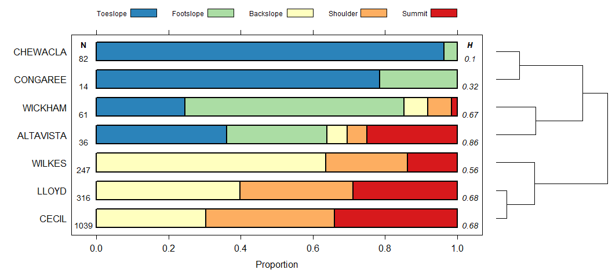
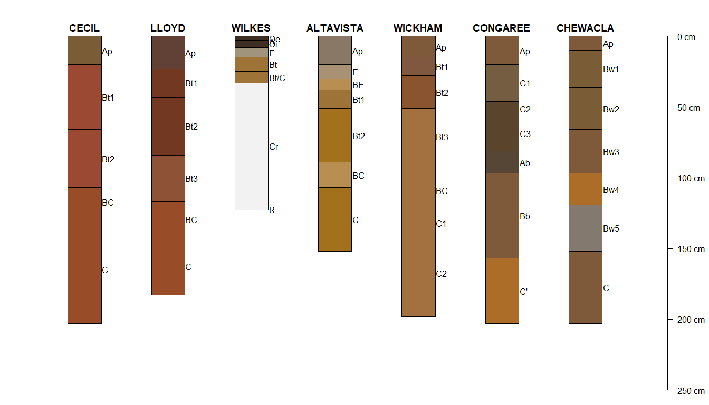
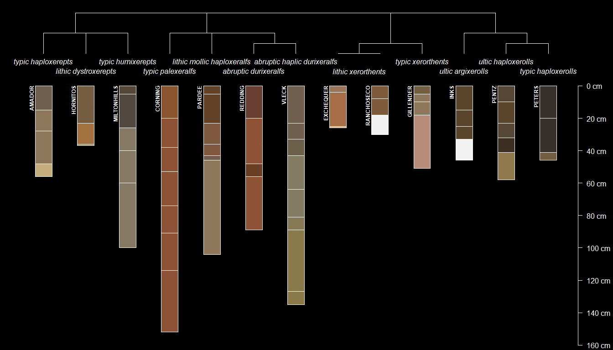

Installation
------------

Get the stable version from CRAN:

`install.packages('soilDB', dependencies = TRUE)`

Get the development version from Github:

`remotes::install_github("ncss-tech/soilDB", dependencies = FALSE, upgrade = FALSE, build = FALSE)`

Website
-------

-   <a href="http://ncss-tech.github.io/AQP/" class="uri">http://ncss-tech.github.io/AQP/</a>

soilDB 2.0
----------

### NASIS

-   low-level functions return empty `data.frame` objects when local
    database (or selected set) is empty
-   `fetchNASIS()` is now a wrapper around pedon and component “fetch”
    functions
-   `uncode()` is now used in all queries to local NASIS database
-   many (coded) column names in pedon `@site` and `@horizons` have
    changed
-   lower case is used for all un-coded data

Database APIs
-------------

-   SDA
    -   [`fetchSDA`](http://ncss-tech.github.io/soilDB/docs/reference/fetchSDA_component.html)
    -   [`fetchSDA_spatial`](http://ncss-tech.github.io/soilDB/docs/reference/fetchSDA_spatial.html)
    -   [`SDA_query`](http://ncss-tech.github.io/soilDB/docs/reference/SDA_query.html)
    -   [`SDA_query_features`](http://ncss-tech.github.io/soilDB/docs/reference/SDA_query_features.html)
-   SSURGO Local Geodatabases
    -   [`fetchGDB`](http://ncss-tech.github.io/soilDB/docs/reference/fetchGDB.html)
-   NASIS local database
    -   [`fetchNASIS`](http://ncss-tech.github.io/soilDB/docs/reference/fetchNASIS.html)
-   NASIS WWW interface
    -   [`parseWebReport`](http://ncss-tech.github.io/soilDB/docs/reference/parseWebReport.html)
    -   [`fetchNASISWebReport`](http://ncss-tech.github.io/soilDB/docs/reference/fetchLIMS_component.html)
-   SSURGO/KSSL via SoilWeb
    -   [`fetchKSSL`](http://ncss-tech.github.io/soilDB/docs/reference/fetchKSSL.html)
    -   [`fetchOSD`](http://ncss-tech.github.io/soilDB/docs/reference/fetchOSD.html)
    -   [`siblings`](http://ncss-tech.github.io/soilDB/docs/reference/siblings.html)
    -   [`OSDquery`](http://ncss-tech.github.io/soilDB/docs/reference/OSDquery.html)
    -   [`seriesExtent`](http://ncss-tech.github.io/soilDB/docs/reference/seriesExtent.html)
    -   [`taxaExtent`](http://ncss-tech.github.io/soilDB/docs/reference/taxaExtent.html)
-   SCAN/SNOTEL
    -   [`fetchSCAN`](http://ncss-tech.github.io/soilDB/docs/reference/fetchSCAN.html)
    -   [`SCAN_SNOTEL_metadata`](http://ncss-tech.github.io/soilDB/docs/reference/SCAN_SNOTEL_metadata.html)
-   Henry Mount Soil and Water Database
    -   [`fetchHenry`](http://ncss-tech.github.io/soilDB/docs/reference/fetchHenry.html)
-   SoilGrids
    -   [`fetchSoilGrids`](http://ncss-tech.github.io/soilDB/docs/reference/fetchSoilGrids.html)

Utility Functions
-----------------

-   [`estimateSTR`](http://ncss-tech.github.io/soilDB/docs/reference/estimateSTR.html)
-   [`STRplot`](http://ncss-tech.github.io/soilDB/docs/reference/STRplot.html)
-   [`KSSL_VG_model`](http://ncss-tech.github.io/soilDB/docs/reference/KSSL_VG_model.html)
-   [`simplfyFragmentData`](http://ncss-tech.github.io/soilDB/docs/reference/simplfyFragmentData.html)
-   [`simplifyColorData`](http://ncss-tech.github.io/soilDB/docs/reference/simplifyColorData.html)
-   [`uncode`](http://ncss-tech.github.io/soilDB/docs/reference/uncode.html)
-   [`code`](http://ncss-tech.github.io/soilDB/docs/reference/uncode.html)
-   [`get_NOAA_GHCND`](http://ncss-tech.github.io/soilDB/docs/reference/get_NOAA_GHCND.html)

Related Documentation
---------------------

-   [fetchKSSL](http://ncss-tech.github.io/AQP/soilDB/KSSL-demo.html)
-   [SDA\_query](http://ncss-tech.github.io/AQP/soilDB/SDA-tutorial.html)
-   [fetchOSD](http://ncss-tech.github.io/AQP/sharpshootR/OSD-dendrogram.html)
-   [SCAN/SNOTEL
    Data](http://ncss-tech.github.io/AQP/soilDB/fetchSCAN-demo.html)

Related Packages
----------------

-   [aqp](https://github.com/ncss-tech/aqp)
-   [sharpshootR](https://github.com/ncss-tech/sharpshootR)

Examples
--------

    library(aqp)
    library(soilDB)
    library(sharpshootR)

    # get morphology + extended summaries
    soils <- c('cecil', 'altavista', 'lloyd', 'wickham', 'wilkes',  'chewacla', 'congaree')
    s <- fetchOSD(soils, extended = TRUE)

    # viz of hillslope position, from SSURGO component records
    res <- vizHillslopePosition(s$hillpos, annotation.cex = 0.9)
    print(res$fig)

    # profile sketches
    par(mar=c(0,1,0,4), xpd=NA)
    plot(s$SPC, plot.order=res$order, cex.names=1, axis.line.offset = -0.1, width=0.2)

    # siblings
    s <- 'Amador'
    amador <- siblings(s, only.major = FALSE, component.data = TRUE)

    # limit to named soil series
    sib.data <- subset(amador$sib.data, !compkind %in% c('Miscellaneous area', 'Family', 'Taxon above family'))

    # get parsed OSD records
    sibs <- fetchOSD(c(s, unique(amador$sib$sibling)), extended = TRUE)

    # invert colors
    par(mar=c(0,0,0,0), fg='white', bg='black')

    # create taxonomy dendrogram
    SoilTaxonomyDendrogram(sibs$SPC, dend.width = 1.5, y.offset = 0.4, 
                           scaling.factor = 0.02, width = 0.2, 
                           cex.taxon.labels = 1, cex.names = 1)

Dependency Graph
----------------

