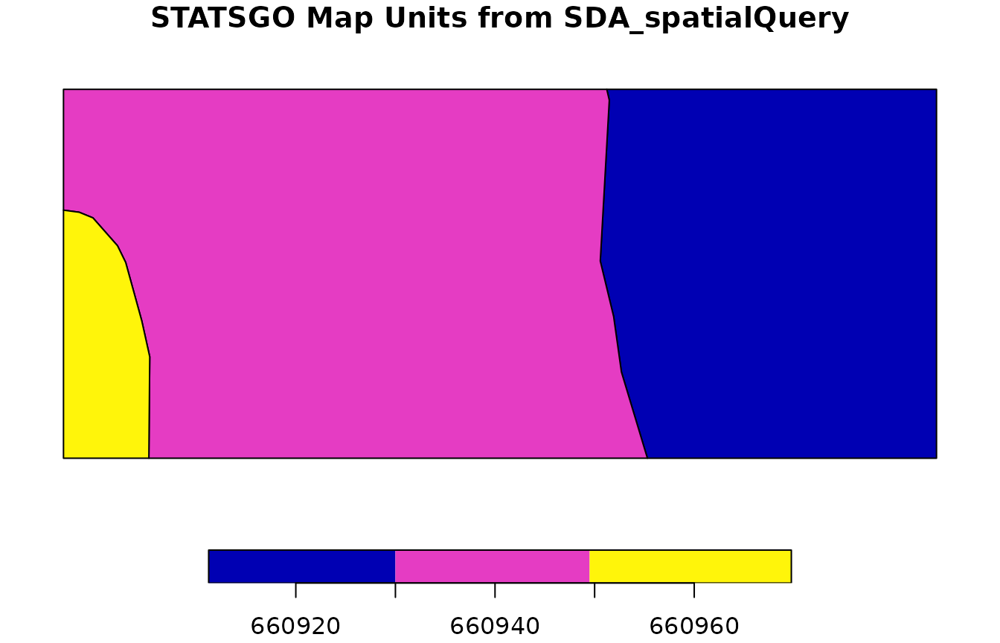

# Mapping Dominant Ecological Sites using SSURGO Data

## Overview

This vignette demonstrates how to extract and map dominant ecological
site information for a given Area of Interest (AOI) using the `soilDB`
package and open-source geospatial tools in R.

For a general introduction to geospatial data in R, see the [`sf`
package documentation](https://r-spatial.github.io/sf/), [`terra`
package documentation](https://rspatial.github.io/terra/), the
[*Geocomputation with R* book](https://r.geocompx.org/) and the
[*Spatial Data Science with R and `terra`* book](https://rspatial.org/).

We will:

- Load SSURGO spatial data

- Query Soil Data Access (SDA) for dominant ecological site assignments

- Join tabular and spatial data

- Export and visualize the results

## Prerequisites

In this vignette we will use `sf` functions and object types for
processing and storing spatial data. This package is used under the hood
by `soilDB` for processing SSURGO data. The `terra` package can be used
with only minor changes in syntax.

``` r
library(soilDB)
library(sf)
```

## Load SSURGO Spatial Data

### Using Soil Data Access

You can use
[`SDA_spatialQuery()`](http://ncss-tech.github.io/soilDB/reference/SDA_spatialQuery.md)
and
[`fetchSDA_spatial()`](http://ncss-tech.github.io/soilDB/reference/fetchSDA_spatial.md)
to retrieve spatial data directly from Soil Data Access (SDA), bypassing
the need for local files.

#### Option 1: Use `SDA_spatialQuery()` to get mukey polygons for an AOI

Define Area of Interest (AOI) as a bounding box `sf` POLYGON.

``` r
aoi <- sf::st_as_sfc(sf::st_bbox(c(
  xmin = -120.85,
  xmax = -120.775,
  ymin = 37.975,
  ymax = 38.0
), crs = 4326))

# Query SDA for map unit polygons cropped to the AOI
soil_polygons <- SDA_spatialQuery(
  aoi, 
  what = "mupolygon"
)

plot(
  soil_polygons["mukey"],
  main = "SSURGO Map Units from SDA_spatialQuery"
)
```


``` r
head(soil_polygons)
```

    ## Simple feature collection with 6 features and 2 fields
    ## Geometry type: POLYGON
    ## Dimension:     XY
    ## Bounding box:  xmin: -120.8235 ymin: 37.98283 xmax: -120.7807 ymax: 38.01469
    ## Geodetic CRS:  WGS 84
    ##     mukey    area_ac                           geom
    ## 1 2441798 187.863380 POLYGON ((-120.7961 38.0051...
    ## 2 2924886   6.788244 POLYGON ((-120.8201 37.9839...
    ## 3 2450844  30.732837 POLYGON ((-120.7897 37.9864...
    ## 4 2924752  11.813110 POLYGON ((-120.7836 37.9887...
    ## 5 2441798  32.166563 POLYGON ((-120.7884 37.9883...
    ## 6 2450844  48.484422 POLYGON ((-120.7985 37.9945...

You can also set `geomIntersection = TRUE` so that intersecting
geometries are cropped to the AOI. This is convenient if you have a very
specific AOI in mind or would like to reduce the amount of data you are
going to download.

``` r
# Query SDA for map unit polygons cropped to the AOI
soil_polygons <- SDA_spatialQuery(
  aoi, 
  what = "mupolygon", 
  geomIntersection = TRUE
)

plot(
  soil_polygons["mukey"],
  main = "Cropped SSURGO Map Units from SDA_spatialQuery"
)
```


``` r
head(soil_polygons)
```

    ## Simple feature collection with 6 features and 2 fields
    ## Geometry type: POLYGON
    ## Dimension:     XY
    ## Bounding box:  xmin: -120.8235 ymin: 37.98283 xmax: -120.7807 ymax: 38
    ## Geodetic CRS:  WGS 84
    ##     mukey   area_ac                           geom
    ## 1 2441798 26.735794 POLYGON ((-120.7922 37.998,...
    ## 2 2924886  6.788244 POLYGON ((-120.82 37.98283,...
    ## 3 2450844 30.732837 POLYGON ((-120.79 37.98505,...
    ## 4 2924752 11.813110 POLYGON ((-120.7836 37.9887...
    ## 5 2441798 32.166563 POLYGON ((-120.786 37.98831...
    ## 6 2450844 48.484422 POLYGON ((-120.8046 37.9885...

#### Option 2: Use `fetchSDA_spatial()`

Next, we use
[`fetchSDA_spatial()`](http://ncss-tech.github.io/soilDB/reference/fetchSDA_spatial.md).

This function is different because instead of using an area of interest,
it takes a vector of map unit or legend identifiers.

Here, we take the unique map unit keys from the **Option 1** result and
return the *full* extent of those map units (not just the intersecting
polygons). This is particularly helpful when doing studies that involve
the full extent of map unit concepts, as opposed to more site-specific
analyses.

``` r
mu_ssurgo <- fetchSDA_spatial(
  unique(soil_polygons$mukey), 
  by.col = "mukey",
  add.fields = c("legend.areaname", 
                 "mapunit.muname", 
                 "mapunit.farmlndcl")
)

plot(mu_ssurgo["mukey"], main = "SSURGO Map Units from fetchSDA_spatial")
```


``` r
head(mu_ssurgo)
```

    ## Simple feature collection with 6 features and 6 fields
    ## Geometry type: POLYGON
    ## Dimension:     XY
    ## Bounding box:  xmin: -120.8318 ymin: 37.87806 xmax: -120.6511 ymax: 38.09373
    ## Geodetic CRS:  WGS 84
    ##     mukey areasymbol nationalmusym
    ## 1 2441798      CA630         2mywp
    ## 2 2441798      CA630         2mywp
    ## 3 2441798      CA630         2mywp
    ## 4 2441798      CA630         2mywp
    ## 5 2441798      CA630         2mywp
    ## 6 2441798      CA630         2mywp
    ##                                                                              areaname
    ## 1 Central Sierra Foothills Area, California, Parts of Calaveras and Tuolumne Counties
    ## 2 Central Sierra Foothills Area, California, Parts of Calaveras and Tuolumne Counties
    ## 3 Central Sierra Foothills Area, California, Parts of Calaveras and Tuolumne Counties
    ## 4 Central Sierra Foothills Area, California, Parts of Calaveras and Tuolumne Counties
    ## 5 Central Sierra Foothills Area, California, Parts of Calaveras and Tuolumne Counties
    ## 6 Central Sierra Foothills Area, California, Parts of Calaveras and Tuolumne Counties
    ##                                                muname          farmlndcl
    ## 1 Bonanza-Loafercreek complex, 3 to 15 percent slopes Not prime farmland
    ## 2 Bonanza-Loafercreek complex, 3 to 15 percent slopes Not prime farmland
    ## 3 Bonanza-Loafercreek complex, 3 to 15 percent slopes Not prime farmland
    ## 4 Bonanza-Loafercreek complex, 3 to 15 percent slopes Not prime farmland
    ## 5 Bonanza-Loafercreek complex, 3 to 15 percent slopes Not prime farmland
    ## 6 Bonanza-Loafercreek complex, 3 to 15 percent slopes Not prime farmland
    ##                             geom
    ## 1 POLYGON ((-120.6513 37.9647...
    ## 2 POLYGON ((-120.7555 37.9478...
    ## 3 POLYGON ((-120.7659 38.0160...
    ## 4 POLYGON ((-120.7961 38.0051...
    ## 5 POLYGON ((-120.8276 38.0924...
    ## 6 POLYGON ((-120.7017 37.8785...

Note that using `add.fields` we have included some additional contextual
information: area name, map unit name, and map unit farmland
classification.

##### `fetchSDA_spatial()` geometry sources

[`fetchSDA_spatial()`](http://ncss-tech.github.io/soilDB/reference/fetchSDA_spatial.md)
`geom.src` argument can be used to return SSURGO map unit polygons and
survey area polygons, STATSGO mapunit polygons, and MLRA polygons.

Here is an example using STATSGO. We use
[`SDA_spatialQuery()`](http://ncss-tech.github.io/soilDB/reference/SDA_spatialQuery.md)
to fetch the data for our AOI, then
[`fetchSDA_spatial()`](http://ncss-tech.github.io/soilDB/reference/fetchSDA_spatial.md)
to get the full extent of those map unit concepts.

``` r
statsgo_polygons <- SDA_spatialQuery(
  aoi, 
  what = "mupolygon",
  db = "STATSGO",
  geomIntersection = TRUE
)

plot(statsgo_polygons["mukey"], main = "STATSGO Map Units from SDA_spatialQuery")
```



``` r
head(statsgo_polygons)
```

    ## Simple feature collection with 3 features and 2 fields
    ## Geometry type: POLYGON
    ## Dimension:     XY
    ## Bounding box:  xmin: -120.85 ymin: 37.975 xmax: -120.775 ymax: 38
    ## Geodetic CRS:  WGS 84
    ##    mukey   area_ac                           geom
    ## 1 660921 1668.6742 POLYGON ((-120.7998 37.975,...
    ## 2 660960  253.0798 POLYGON ((-120.85 37.975, -...
    ## 3 660939 2596.0225 POLYGON ((-120.8427 37.975,...

``` r
mu_statsgo <- fetchSDA_spatial(
  unique(statsgo_polygons$mukey), 
  by.col = "mukey",
  db = "STATSGO",
  add.fields = c("legend.areaname", "mapunit.muname", "mapunit.farmlndcl")
)

plot(mu_statsgo["mukey"], main = "STATSGO Map Units from fetchSDA_spatial")
```


``` r
head(mu_statsgo)
```

    ## Simple feature collection with 6 features and 6 fields
    ## Geometry type: POLYGON
    ## Dimension:     XY
    ## Bounding box:  xmin: -121.0731 ymin: 37.07511 xmax: -119.9157 ymax: 38.29961
    ## Geodetic CRS:  WGS 84
    ##    mukey areasymbol nationalmusym      areaname
    ## 1 660921         US          q5r1 United States
    ## 2 660939         US          q5rm United States
    ## 3 660960         US          q5s9 United States
    ## 4 660939         US          q5rm United States
    ## 5 660939         US          q5rm United States
    ## 6 660939         US          q5rm United States
    ##                                 muname farmlndcl                           geom
    ## 1 Whiterock-Rock outcrop-Auburn (s818)      <NA> POLYGON ((-120.794 38.18986...
    ## 2                  Peters-Pentz (s836)      <NA> POLYGON ((-120.9141 38.0735...
    ## 3       Finrod-Cogna-Archerdale (s857)      <NA> POLYGON ((-120.9711 37.9490...
    ## 4                  Peters-Pentz (s836)      <NA> POLYGON ((-121.0478 38.2898...
    ## 5                  Peters-Pentz (s836)      <NA> POLYGON ((-120.8763 37.8606...
    ## 6                  Peters-Pentz (s836)      <NA> POLYGON ((-120.801 37.92773...

``` r
ssas <- SDA_spatialQuery(aoi, what = "areasymbol")
ssas
```

    ##   areasymbol
    ## 1      CA630
    ## 2      CA632

``` r
ssa <- fetchSDA_spatial(
  ssas$areasymbol, 
  by.col = "areasymbol",
  geom.src = "sapolygon",
  add.fields = c("legend.areaname")
)

plot(ssa["areasymbol"], main = "SSURGO Soil Survey Area from SDA")
```


``` r
head(ssa)
```

    ## Simple feature collection with 2 features and 3 fields
    ## Geometry type: POLYGON
    ## Dimension:     XY
    ## Bounding box:  xmin: -120.9955 ymin: 37.63352 xmax: -120.1595 ymax: 38.46714
    ## Geodetic CRS:  WGS 84
    ##    lkey areasymbol
    ## 1 14103      CA630
    ## 2 17969      CA632
    ##                                                                              areaname
    ## 1 Central Sierra Foothills Area, California, Parts of Calaveras and Tuolumne Counties
    ## 2                                        Stanislaus County, California, Northern Part
    ##                             geom
    ## 1 POLYGON ((-120.3907 38.4630...
    ## 2 POLYGON ((-120.6584 37.8202...

#### `SDA_spatialQuery()` vs. `fetchSDA_spatial()`

- [`SDA_spatialQuery()`](http://ncss-tech.github.io/soilDB/reference/SDA_spatialQuery.md)
  is ideal for spatial queries where you have a specific, possibly
  complex, area of interest.

- [`fetchSDA_spatial()`](http://ncss-tech.github.io/soilDB/reference/fetchSDA_spatial.md)
  returns the full extent of the specified map unit concepts, optionally
  including more legend and map unit attributes via `add.fields`
  argument.

### Local Data Sources

If working with large extents, it is generally better to be use a local
data source. You can download SSURGO data from Web Soil Survey using
[`downloadSSURGO()`](http://ncss-tech.github.io/soilDB/reference/downloadSSURGO.md).
Then, you can create GeoPackage or other database types using
[`createSSURGO()`](http://ncss-tech.github.io/soilDB/reference/createSSURGO.md)
or the
[SSURGOPortal](https://www.nrcs.usda.gov/resources/data-and-reports/ssurgo-portal)
tools. This process is described in detail in the [Local SSURGO
Databases
vignette](https://ncss-tech.github.io/soilDB/articles/local-ssurgo.html).
See also the [SSURGOPortal R
package](https://github.com/brownag/SSURGOPortalR).

Assuming you have a GeoPackage from SSURGOPortal (`"soilmu_a.gpkg"`),
then you can read it with
[`sf::st_read()`](https://r-spatial.github.io/sf/reference/st_read.html)
or
[`terra::vect()`](https://rspatial.github.io/terra/reference/vect.html)

``` r
ssurgo_path <- "data/soilmu_a.gpkg"  # Replace with your actual path
soil_polygons <- sf::st_read(ssurgo_path)
head(soil_polygons)
```

This `soil_polygons` object should have the standard set of columns we
would expect for a SSURGO map unit data source, including: map unit key
(`mukey`), area symbol (`areasymbol`), map unit symbol (`musym`).

## Query SDA for Dominant Ecological Site Info

### Extract Unique Map Unit Keys

As we did above for
[`fetchSDA_spatial()`](http://ncss-tech.github.io/soilDB/reference/fetchSDA_spatial.md)
we are going to get the unique set of map units in our AOI.

``` r
mukeys <- unique(soil_polygons$mukey)
```

### Use `get_SDA_coecoclass()`

``` r
eco_data <- get_SDA_coecoclass(mukeys = mukeys)
head(eco_data)
```

    ##     mukey areasymbol  lkey                                      muname    cokey
    ## 1 1403409      CA632 17969 Archerdale clay loam, 0 to 2 percent slopes 27449761
    ## 2 1403409      CA632 17969 Archerdale clay loam, 0 to 2 percent slopes 27449762
    ## 3 1403409      CA632 17969 Archerdale clay loam, 0 to 2 percent slopes 27449763
    ## 4 1403409      CA632 17969 Archerdale clay loam, 0 to 2 percent slopes 27449764
    ## 5 1403409      CA632 17969 Archerdale clay loam, 0 to 2 percent slopes 27449765
    ## 6 1403409      CA632 17969 Archerdale clay loam, 0 to 2 percent slopes 27449766
    ##   coecoclasskey comppct_r majcompflag   compname localphase compkind
    ## 1            NA         4         No       Capay       clay   Series
    ## 2            NA         1         No     Chuloak sandy loam   Series
    ## 3            NA         2         No  Clear Lake       clay   Series
    ## 4            NA         1         No      Finrod       clay   Series
    ## 5            NA         3         No  Hicksville       loam   Series
    ## 6            NA         3         No  Hollenbeck       clay   Series
    ##     ecoclassid ecoclassname ecoclasstypename  ecoclassref
    ## 1 Not assigned Not assigned     Not assigned Not assigned
    ## 2 Not assigned Not assigned     Not assigned Not assigned
    ## 3 Not assigned Not assigned     Not assigned Not assigned
    ## 4 Not assigned Not assigned     Not assigned Not assigned
    ## 5 Not assigned Not assigned     Not assigned Not assigned
    ## 6 Not assigned Not assigned     Not assigned Not assigned

This function returns a data frame including `mukey`, `cokey`,
`ecoclassid`, and `ecoclassname`.

There are several methods for aggregating from component to map unit
level available in
[`get_SDA_coecoclass()`](http://ncss-tech.github.io/soilDB/reference/get_SDA_coecoclass.md).
The default aggregation method is `"none"` which will return 1 record
per map unit *component*, so many map units will have more than one
record.

### Using `method="dominant component"`

Most often, users want “typical” conditions that can apply to a whole
map unit.

Sometimes it is helpful to be able to point to a *specific* component,
so that you do not have to reason over mathematical aggregation of
distinct components within map unit concepts. The most common method to
select one component per map unit is `"dominant component"`

``` r
eco_data_domcond <- get_SDA_coecoclass(
  mukeys = mukeys,
  method = "dominant component"
)
head(eco_data_domcond)
```

    ##      mukey areasymbol  lkey
    ## 8  1403409      CA632 17969
    ## 13 1403418      CA632 17969
    ## 15 1403432      CA632 17969
    ## 19 1403439      CA632 17969
    ## 30 1540892      CA632 17969
    ## 31 1605509      CA632 17969
    ##                                                          muname    cokey
    ## 8                   Archerdale clay loam, 0 to 2 percent slopes 27449768
    ## 13 Hicksville loam, 0 to 2 percent slopes, occasionally flooded 27449813
    ## 15            Redding gravelly loam, 0 to 8 percent slopes, dry 27449968
    ## 19              Peters-Pentz association, 2 to 8 percent slopes 27450031
    ## 30                     Mckeonhills clay, 5 to 15 percent slopes 27450072
    ## 31             Pentz-Peters association, 2 to 50 percent slopes 27450044
    ##    coecoclasskey comppct_r majcompflag    compname      localphase compkind
    ## 8       12784144        85         Yes  Archerdale       clay loam   Series
    ## 13      12784163        85         Yes  Hicksville            loam   Series
    ## 15      12784219        85         Yes     Redding   gravelly loam   Series
    ## 19      12784259        60         Yes      Peters silty clay loam   Series
    ## 30      12784278        90         Yes Mckeonhills            clay   Series
    ## 31      12784267        62         Yes       Pentz       silt loam   Series
    ##     ecoclassid                    ecoclassname    ecoclasstypename
    ## 8  R017XY903CA Stream Channels and Floodplains NRCS Rangeland Site
    ## 13 R017XY905CA  Dry Alluvial Fans and Terraces NRCS Rangeland Site
    ## 15 R017XY902CA            Duripan Vernal Pools NRCS Rangeland Site
    ## 19 R018XI164CA         Clayey Dissected Swales NRCS Rangeland Site
    ## 30 R018XI163CA       Thermic Low Rolling Hills NRCS Rangeland Site
    ## 31 R018XI163CA       Thermic Low Rolling Hills NRCS Rangeland Site
    ##                             ecoclassref
    ## 8  Ecological Site Description Database
    ## 13 Ecological Site Description Database
    ## 15 Ecological Site Description Database
    ## 19 Ecological Site Description Database
    ## 30 Ecological Site Description Database
    ## 31 Ecological Site Description Database

Note that this output includes information for the dominant component
(`comppct_r` and `compname`).

### Using `method="dominant condition"`

The method `"dominant condition"` is convenient because it accounts for
the possibility that multiple components have the same class (ecological
site) and can have their component percentages summed.

For a property like ecological site, it is fairly common for multiple
components in a map unit to have the same site assigned, so the dominant
condition makes up a higher percentage of the area of the map unit than
the dominant component alone.

``` r
eco_data_domcond <- get_SDA_coecoclass(
  mukeys = mukeys,
  method = "dominant condition"
)
head(eco_data_domcond)
```

    ##      mukey areasymbol  lkey
    ## 8  1403409      CA632 17969
    ## 13 1403418      CA632 17969
    ## 15 1403432      CA632 17969
    ## 19 1403439      CA632 17969
    ## 30 1540892      CA632 17969
    ## 31 1605509      CA632 17969
    ##                                                          muname    cokey
    ## 8                   Archerdale clay loam, 0 to 2 percent slopes 27449768
    ## 13 Hicksville loam, 0 to 2 percent slopes, occasionally flooded 27449813
    ## 15            Redding gravelly loam, 0 to 8 percent slopes, dry 27449968
    ## 19              Peters-Pentz association, 2 to 8 percent slopes 27450031
    ## 30                     Mckeonhills clay, 5 to 15 percent slopes 27450072
    ## 31             Pentz-Peters association, 2 to 50 percent slopes 27450044
    ##    coecoclasskey comppct_r majcompflag    compname      localphase compkind
    ## 8       12784144        85         Yes  Archerdale       clay loam   Series
    ## 13      12784163        85         Yes  Hicksville            loam   Series
    ## 15      12784219        85         Yes     Redding   gravelly loam   Series
    ## 19      12784259        60         Yes      Peters silty clay loam   Series
    ## 30      12784278        90         Yes Mckeonhills            clay   Series
    ## 31      12784267        62         Yes       Pentz       silt loam   Series
    ##     ecoclassid                    ecoclassname    ecoclasstypename
    ## 8  R017XY903CA Stream Channels and Floodplains NRCS Rangeland Site
    ## 13 R017XY905CA  Dry Alluvial Fans and Terraces NRCS Rangeland Site
    ## 15 R017XY902CA            Duripan Vernal Pools NRCS Rangeland Site
    ## 19 R018XI164CA         Clayey Dissected Swales NRCS Rangeland Site
    ## 30 R018XI163CA       Thermic Low Rolling Hills NRCS Rangeland Site
    ## 31 R018XI163CA       Thermic Low Rolling Hills NRCS Rangeland Site
    ##                             ecoclassref ecoclasspct_r
    ## 8  Ecological Site Description Database            85
    ## 13 Ecological Site Description Database            85
    ## 15 Ecological Site Description Database            85
    ## 19 Ecological Site Description Database            60
    ## 30 Ecological Site Description Database            92
    ## 31 Ecological Site Description Database            67

Note that this result includes the aggregate ecological site composition
`ecoclasspct_r`.

The `cokey` and `comppct_r` are from the dominant component can be used
to link to a specific, common component for other more detailed
information.

## Join Tabular and Spatial Data

We want to have a 1:1 relationship between our map unit polygons and the
thematic variable we are mapping, so we will use the map unit dominant
condition ecological sites (`eco_data_domcond`).

``` r
soil_polygons <- merge(
  soil_polygons, 
  eco_data_domcond, 
  by = "mukey"
)
```

## Visualize the Result

``` r
plot(
  soil_polygons["ecoclassid"],
  main = "Dominant Ecological Site by Map Unit"
)
```


This same process for merging in aggregate map unit level information
generalizes to other SSURGO tables. You can easily create thematic maps
from any data you can aggregate to the point that it is 1:1 with the
`mukey`.

## Export Spatial File

Finally, we can write our result out to a spatial file, such as a
GeoPackage, using `sf` or `terra`.

``` r
sf::st_write(
  soil_polygons, 
  "ecosite_dominant.gpkg", 
  delete_dsn = TRUE
)
```

## References

### SSURGO Data and Tools

- [SSURGOPortal](https://www.nrcs.usda.gov/resources/data-and-reports/ssurgo-portal)
- [Web Soil Survey](https://websoilsurvey.nrcs.usda.gov/app/)

### soilDB functions

- [`SDA_spatialQuery()`
  documentation](https://ncss-tech.github.io/soilDB/reference/SDA_spatialQuery.html)
- [`fetchSDA_spatial()`
  documentation](https://ncss-tech.github.io/soilDB/reference/fetchSDA_spatial.html)
- [`get_SDA_coecoclass()`
  documentation](https://ncss-tech.github.io/soilDB/reference/get_SDA_coecoclass.html)

### Spatial Analysis in R

- [`sf` package documentation](https://r-spatial.github.io/sf/)
- [`terra` package documentation](https://rspatial.github.io/terra/)
- [*Geocomputation with R* book](https://r.geocompx.org/)
- [*Spatial Data Science with R and `terra`*
  book](https://rspatial.org/).
