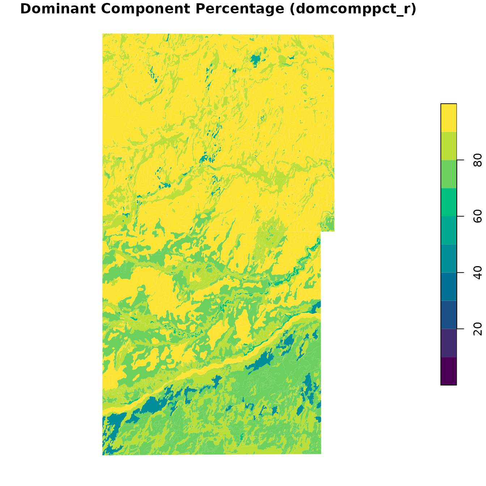
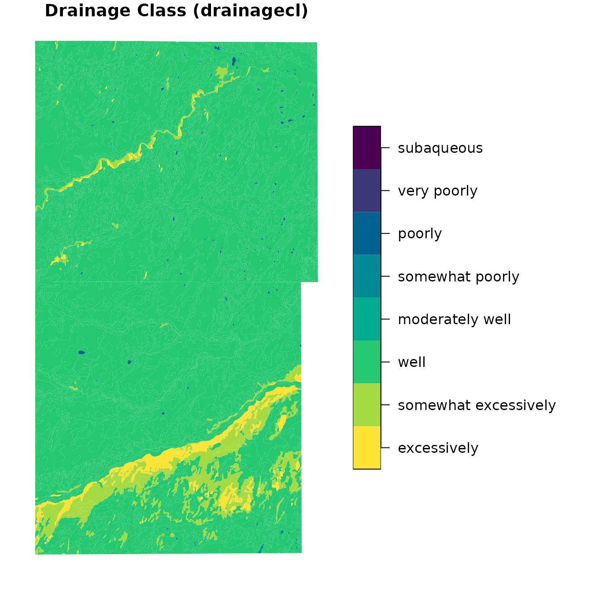

# Local Soil Survey Geographic (SSURGO) Databases

## Overview

The `soilDB` package provides tools for accessing and working with soil
survey data from the USDA-NRCS. Two key functions,
[`downloadSSURGO()`](http://ncss-tech.github.io/soilDB/reference/downloadSSURGO.md)
and
[`createSSURGO()`](http://ncss-tech.github.io/soilDB/reference/createSSURGO.md),
streamline the process of acquiring and preparing Soil Survey Geographic
database (SSURGO) data into a local SQLite (GeoPackage) database–similar
to the functionality offered by [SSURGO
Portal](https://nrcs.usda.gov/resources/data-and-reports/ssurgo-portal).

This vignette demonstrates how to use these functions to obtain and view
data from *Morton and Stanton counties, Kansas*
(`areasymbol = c("KS129", "KS187")`).

## Download SSURGO Data

[`downloadSSURGO()`](http://ncss-tech.github.io/soilDB/reference/downloadSSURGO.md)
will download the official SSURGO data from Web Soil Survey for the
specified `areasymbol` and return the path to the ZIP archives.

``` r
library(soilDB)

gpkg_dir <- tempdir()

AREASYMBOLS <- c("KS129", "KS187")

ssurgo_zip <- downloadSSURGO(
  areasymbol = AREASYMBOLS, 
  destdir = gpkg_dir
)
```

Here we specify just two soil survey areas of interest using the “area
symbol.” Generally, this is a 2-letter state code and a 3-digit county
FIPS code or other identifier.

There are more options to specify the area of interest. Any SQL WHERE
clause that targets the `sacatalog` (Soil Survey Area Catalog) table can
be used.

For example, to do all soil survey areas in Kansas, instead of
`areasymbol` we could set `WHERE = "areasymbol LIKE 'KS%'"`.
Alternately, `WHERE` can be any R spatial object, which is passed to
[`SDA_spatialQuery()`](http://ncss-tech.github.io/soilDB/reference/SDA_spatialQuery.md)
to determine area symbols of interest.

We specify `destdir` as the destination directory to download
area-specific ZIP files.

If unspecified, `exdir,`the directory the ZIP files get extracted to, is
the same as `destdir`. If you want to keep the ZIP files and extracted
data, set `destdir`. If you only want the extracted data, set `exdir`.
If you want both to be kept only temporarily in order to create a new
database, leave `destdir` as the default
([`tempdir()`](https://rdrr.io/r/base/tempfile.html)).

## Create a Local SSURGO Database

The
[`createSSURGO()`](http://ncss-tech.github.io/soilDB/reference/createSSURGO.md)
function uses the `sf` and `RSQLite` packages internally to build a
SQLite database. A suggested SQLite-based format to use is
[GeoPackage](https://www.geopackage.org/) (`".gpkg"` file), as it is an
open format with a well-defined standard.

``` r
# Create a local GeoPackage from the downloaded ZIP
gpkg_path <- file.path(gpkg_dir, "ssurgo.gpkg")

createSSURGO(
  gpkg_path,
  exdir = gpkg_dir
)
```

Here we pass `exdir` so
[`createSSURGO()`](http://ncss-tech.github.io/soilDB/reference/createSSURGO.md)
knows where to look for the data that
[`downloadSSURGO()`](http://ncss-tech.github.io/soilDB/reference/downloadSSURGO.md)
extracted from ZIP files. If we supply `con` argument instead of
`filename` we can connect to arbitrary *DBIConnection* objects, which
could include those for other database connection types such as DuckDB
or PostgresSQL.

The resulting `.gpkg` file is a spatially-enabled SQLite database that
can be used in GIS software or queried directly in R.

## Load and Explore the Database

Once the GeoPackage is created, you can connect to it using `DBI` and
explore its contents. The database follows the SSURGO schema, which
includes tables like `mapunit`, `component`, `chorizon`, and spatial
layers such as the spatial map unit polygon layer, `mupolygon`.

``` r
library(DBI)
library(RSQLite)

# Connect to the GeoPackage
con <- dbConnect(SQLite(), gpkg_path)

# List available tables
dbListTables(con)
```

    ##  [1] "chaashto"                    "chconsistence"              
    ##  [3] "chdesgnsuffix"               "chfrags"                    
    ##  [5] "chorizon"                    "chpores"                    
    ##  [7] "chstruct"                    "chstructgrp"                
    ##  [9] "chtexture"                   "chtexturegrp"               
    ## [11] "chtexturemod"                "chunified"                  
    ## [13] "cocropyld"                   "codiagfeatures"             
    ## [15] "coecoclass"                  "coeplants"                  
    ## [17] "coerosionacc"                "cogeomordesc"               
    ## [19] "cohydriccriteria"            "cointerp"                   
    ## [21] "comonth"                     "component"                  
    ## [23] "copm"                        "copmgrp"                    
    ## [25] "copwindbreak"                "corestrictions"             
    ## [27] "cosoilmoist"                 "cosurffrags"                
    ## [29] "cosurfmorphgc"               "cosurfmorphhpp"             
    ## [31] "cosurfmorphmr"               "cosurfmorphss"              
    ## [33] "cotaxfmmin"                  "cotaxmoistcl"               
    ## [35] "cotext"                      "cotreestomng"               
    ## [37] "cotxfmother"                 "distinterpmd"               
    ## [39] "distlegendmd"                "distmd"                     
    ## [41] "featdesc"                    "featline"                   
    ## [43] "featpoint"                   "gpkg_contents"              
    ## [45] "gpkg_extensions"             "gpkg_geometry_columns"      
    ## [47] "gpkg_ogr_contents"           "gpkg_spatial_ref_sys"       
    ## [49] "gpkg_tile_matrix"            "gpkg_tile_matrix_set"       
    ## [51] "laoverlap"                   "legend"                     
    ## [53] "mapunit"                     "mdstatdomdet"               
    ## [55] "mdstatdommas"                "mdstatidxdet"               
    ## [57] "mdstatidxmas"                "mdstatrshipdet"             
    ## [59] "mdstatrshipmas"              "mdstattabcols"              
    ## [61] "mdstattabs"                  "muaggatt"                   
    ## [63] "muaoverlap"                  "muline"                     
    ## [65] "mupoint"                     "mupolygon"                  
    ## [67] "rtree_featline_geom"         "rtree_featline_geom_node"   
    ## [69] "rtree_featline_geom_parent"  "rtree_featline_geom_rowid"  
    ## [71] "rtree_featpoint_geom"        "rtree_featpoint_geom_node"  
    ## [73] "rtree_featpoint_geom_parent" "rtree_featpoint_geom_rowid" 
    ## [75] "rtree_muline_geom"           "rtree_muline_geom_node"     
    ## [77] "rtree_muline_geom_parent"    "rtree_muline_geom_rowid"    
    ## [79] "rtree_mupoint_geom"          "rtree_mupoint_geom_node"    
    ## [81] "rtree_mupoint_geom_parent"   "rtree_mupoint_geom_rowid"   
    ## [83] "rtree_mupolygon_geom"        "rtree_mupolygon_geom_node"  
    ## [85] "rtree_mupolygon_geom_parent" "rtree_mupolygon_geom_rowid" 
    ## [87] "rtree_sapolygon_geom"        "rtree_sapolygon_geom_node"  
    ## [89] "rtree_sapolygon_geom_parent" "rtree_sapolygon_geom_rowid" 
    ## [91] "sacatalog"                   "sainterp"                   
    ## [93] "sapolygon"                   "sdvalgorithm"               
    ## [95] "sdvattribute"                "sdvfolder"                  
    ## [97] "sdvfolderattribute"          "soil_metadata"              
    ## [99] "sqlite_sequence"

### View Table Structure

You can inspect the structure of a specific table, such as `mapunit`,
which contains general information about each map unit.

``` r
dbListFields(con, "mapunit")
```

    ##  [1] "musym"         "muname"        "mukind"        "mustatus"     
    ##  [5] "muacres"       "mapunitlfw_l"  "mapunitlfw_r"  "mapunitlfw_h" 
    ##  [9] "mapunitpfa_l"  "mapunitpfa_r"  "mapunitpfa_h"  "farmlndcl"    
    ## [13] "muhelcl"       "muwathelcl"    "muwndhelcl"    "interpfocus"  
    ## [17] "invesintens"   "iacornsr"      "nhiforsoigrp"  "nhspiagr"     
    ## [21] "vtsepticsyscl" "mucertstat"    "lkey"          "mukey"

### Basic Queries

You can write arbitrary queries to run against the SQLite connection to
the local database.

For example, a query to look at the first `5` rows of the `mapunit`
table:

``` r
dbGetQuery(con, "SELECT * FROM mapunit LIMIT 5")
```

    ##   musym                                                muname       mukind
    ## 1  1510             Atchison clay loam, 3 to 6 percent slopes Consociation
    ## 2  5110       Atchison fine sandy loam, 1 to 3 percent slopes Consociation
    ## 3  1511                  Atchison loam, 1 to 3 percent slopes Consociation
    ## 4  1512                  Atchison loam, 6 to 9 percent slopes Consociation
    ## 5  1515 Atchison-Rock outcrop complex, 6 to 20 percent slopes      Complex
    ##   mustatus muacres mapunitlfw_l mapunitlfw_r mapunitlfw_h mapunitpfa_l
    ## 1       NA   15733           NA           NA           NA           NA
    ## 2       NA      62           NA           NA           NA           NA
    ## 3       NA   36516           NA           NA           NA           NA
    ## 4       NA    4666           NA           NA           NA           NA
    ## 5       NA    3488           NA           NA           NA           NA
    ##   mapunitpfa_r mapunitpfa_h                        farmlndcl muhelcl muwathelcl
    ## 1           NA           NA Farmland of statewide importance      NA         NA
    ## 2           NA           NA      Prime farmland if irrigated      NA         NA
    ## 3           NA           NA      Prime farmland if irrigated      NA         NA
    ## 4           NA           NA Farmland of statewide importance      NA         NA
    ## 5           NA           NA Farmland of statewide importance      NA         NA
    ##   muwndhelcl interpfocus invesintens iacornsr nhiforsoigrp nhspiagr
    ## 1         NA                 Order 2       NA           NA       NA
    ## 2         NA                 Order 2       NA           NA       NA
    ## 3         NA                 Order 2       NA           NA       NA
    ## 4         NA                 Order 2       NA           NA       NA
    ## 5         NA                 Order 2       NA           NA       NA
    ##   vtsepticsyscl mucertstat  lkey   mukey
    ## 1            NA         NA 10591 1382580
    ## 2            NA         NA 10591 1382581
    ## 3            NA         NA 10591 1382582
    ## 4            NA         NA 10591 1382583
    ## 5            NA         NA 10591 1382584

### Join Tables

You can join tables to explore relationships between map units and their
components:

``` r
query <- "
SELECT mu.musym, mu.muname, c.compname, c.comppct_r
FROM mapunit mu
JOIN component c ON mu.mukey = c.mukey
LIMIT 10
"
dbGetQuery(con, query)
```

    ##    musym                                          muname compname comppct_r
    ## 1   1510       Atchison clay loam, 3 to 6 percent slopes Atchison        90
    ## 2   1510       Atchison clay loam, 3 to 6 percent slopes    Otero        10
    ## 3   5110 Atchison fine sandy loam, 1 to 3 percent slopes   Bigbow         5
    ## 4   5110 Atchison fine sandy loam, 1 to 3 percent slopes Atchison        70
    ## 5   5110 Atchison fine sandy loam, 1 to 3 percent slopes    Otero        25
    ## 6   1511            Atchison loam, 1 to 3 percent slopes  Satanta         5
    ## 7   1511            Atchison loam, 1 to 3 percent slopes Atchison        85
    ## 8   1511            Atchison loam, 1 to 3 percent slopes    Otero        10
    ## 9   1512            Atchison loam, 6 to 9 percent slopes Atchison        80
    ## 10  1512            Atchison loam, 6 to 9 percent slopes    Otero        20

### Load Spatial Data

To work with spatial data, we will use the [`sf`
package](https://r-spatial.github.io/sf/).

Here we demonstrate how to read the `mupolygon` layer, which contains
the polygon geometries of delineations of specific map unit concepts:

``` r
library(sf)

# Read spatial map units
spatial_mu <- st_read(gpkg_path, layer = "mupolygon")
```

    ## Reading layer `mupolygon' from data source `/tmp/Rtmp5OzErC/ssurgo.gpkg' using driver `GPKG'
    ## Simple feature collection with 3333 features and 4 fields
    ## Geometry type: POLYGON
    ## Dimension:     XY
    ## Bounding box:  xmin: -102.0421 ymin: 36.99309 xmax: -101.5257 ymax: 37.7385
    ## Geodetic CRS:  WGS 84

``` r
spatial_mu
```

    ## Simple feature collection with 3333 features and 4 fields
    ## Geometry type: POLYGON
    ## Dimension:     XY
    ## Bounding box:  xmin: -102.0421 ymin: 36.99309 xmax: -101.5257 ymax: 37.7385
    ## Geodetic CRS:  WGS 84
    ## First 10 features:
    ##    areasymbol spatialver musym   mukey                           geom
    ## 1       KS129          6  1996 1382616 POLYGON ((-101.6324 37.3092...
    ## 2       KS129          6  1511 1382582 POLYGON ((-101.8048 37.3059...
    ## 3       KS129          6  1462 1382612 POLYGON ((-101.6826 37.2779...
    ## 4       KS129          6  1462 1382612 POLYGON ((-101.7427 37.2780...
    ## 5       KS129          6  1462 1382612 POLYGON ((-101.7587 37.2658...
    ## 6       KS129          6  5236 1382597 POLYGON ((-101.5803 37.2443...
    ## 7       KS129          6  1706 1382607 POLYGON ((-101.6693 37.2019...
    ## 8       KS129          6  1462 1382612 POLYGON ((-101.9686 37.3273...
    ## 9       KS129          6  5220 1382593 POLYGON ((-101.8502 37.0818...
    ## 10      KS129          6  1511 1382582 POLYGON ((-101.9917 37.1193...

``` r
# Plot the map units
plot(st_geometry(spatial_mu))
```


This spatial layer can be used for mapping or spatial joins with other
geospatial data sets. The `mukey` column is the unique map unit
identifier. Any SSURGO data that can be queried or aggregated to be 1:1
with `mukey` can be used in thematic mapping.

## Visualizing Soil Properties

You can visualize soil properties by joining tabular data with the
`mupolygon` layer and plotting with base R graphics.

### Load Tabular Data

Here we look at the first few rows of `mapunit` and `component`, two
critical tables in the SSURGO schema.

``` r
# Read tabular data
mapunit <- dbReadTable(con, "mapunit")
head(mapunit)
```

    ##   musym                                                muname       mukind
    ## 1  1510             Atchison clay loam, 3 to 6 percent slopes Consociation
    ## 2  5110       Atchison fine sandy loam, 1 to 3 percent slopes Consociation
    ## 3  1511                  Atchison loam, 1 to 3 percent slopes Consociation
    ## 4  1512                  Atchison loam, 6 to 9 percent slopes Consociation
    ## 5  1515 Atchison-Rock outcrop complex, 6 to 20 percent slopes      Complex
    ## 6  1550         Belfon clay loam, cool, 0 to 1 percent slopes Consociation
    ##   mustatus muacres mapunitlfw_l mapunitlfw_r mapunitlfw_h mapunitpfa_l
    ## 1       NA   15733           NA           NA           NA           NA
    ## 2       NA      62           NA           NA           NA           NA
    ## 3       NA   36516           NA           NA           NA           NA
    ## 4       NA    4666           NA           NA           NA           NA
    ## 5       NA    3488           NA           NA           NA           NA
    ## 6       NA    5811           NA           NA           NA           NA
    ##   mapunitpfa_r mapunitpfa_h                        farmlndcl muhelcl muwathelcl
    ## 1           NA           NA Farmland of statewide importance      NA         NA
    ## 2           NA           NA      Prime farmland if irrigated      NA         NA
    ## 3           NA           NA      Prime farmland if irrigated      NA         NA
    ## 4           NA           NA Farmland of statewide importance      NA         NA
    ## 5           NA           NA Farmland of statewide importance      NA         NA
    ## 6           NA           NA      Prime farmland if irrigated      NA         NA
    ##   muwndhelcl interpfocus invesintens iacornsr nhiforsoigrp nhspiagr
    ## 1         NA                 Order 2       NA           NA       NA
    ## 2         NA                 Order 2       NA           NA       NA
    ## 3         NA                 Order 2       NA           NA       NA
    ## 4         NA                 Order 2       NA           NA       NA
    ## 5         NA                 Order 2       NA           NA       NA
    ## 6         NA    cropland     Order 2       NA           NA       NA
    ##   vtsepticsyscl mucertstat  lkey   mukey
    ## 1            NA         NA 10591 1382580
    ## 2            NA         NA 10591 1382581
    ## 3            NA         NA 10591 1382582
    ## 4            NA         NA 10591 1382583
    ## 5            NA         NA 10591 1382584
    ## 6            NA         NA 10591 1382585

``` r
component <- dbReadTable(con, "component")
head(component)
```

    ##   comppct_l comppct_r comppct_h compname compkind majcompflag        otherph
    ## 1        NA        90        NA Atchison   Series         Yes               
    ## 2        NA        10        NA    Otero   Series         No  HIGH PPT, NIRR
    ## 3        NA         5        NA   Bigbow   Series         No                
    ## 4        NA        70        NA Atchison   Series         Yes               
    ## 5        NA        25        NA    Otero   Series         No  HIGH PPT, NIRR
    ## 6        NA         5        NA  Satanta   Series         No  PE<31, MAAT>45
    ##   localphase slope_l slope_r slope_h slopelenusle_l slopelenusle_r
    ## 1                  3       5       6             NA             61
    ## 2                  4      10      15             NA             23
    ## 3                  0       1       1             NA            107
    ## 4                  1       2       3             NA             76
    ## 5                  2       3       4             NA             61
    ## 6                  0       1       1             NA            107
    ##   slopelenusle_h runoff tfact wei weg erocl earthcovkind1 earthcovkind2
    ## 1             NA Medium     5  86  4L                                  
    ## 2             NA Medium     5  86   3                                  
    ## 3             NA    Low     5  86   3                                  
    ## 4             NA    Low     5  86   3                                  
    ## 5             NA    Low     5  86   3                                  
    ## 6             NA    Low     5  56   5                                  
    ##   hydricon hydricrating                   drainagecl elev_l elev_r elev_h
    ## 1                    No                 Well drained    732    915   1097
    ## 2                    No Somewhat excessively drained    732    915   1097
    ## 3                    No                 Well drained    732    915   1097
    ## 4                    No                 Well drained    732    915   1097
    ## 5                    No Somewhat excessively drained   1372   1524   1676
    ## 6                    No                 Well drained    610    915   1219
    ##   aspectccwise aspectrep aspectcwise                                   geomdesc
    ## 1            0       180         359                     fan remnants on breaks
    ## 2            0       180         359                     fan remnants on breaks
    ## 3            0       180         359             paleoterraces on river valleys
    ## 4            0       180         359                     fan remnants on breaks
    ## 5            0       180         359                     fan remnants on breaks
    ## 6            0       180         359 sand sheets on paleoterraces on tablelands
    ##   albedodry_l albedodry_r albedodry_h airtempa_l airtempa_r airtempa_h map_l
    ## 1          NA        0.16          NA          5         13         22   400
    ## 2          NA        0.23          NA          5         13         22   400
    ## 3          NA        0.23          NA          6         13         21   400
    ## 4          NA        0.16          NA          5         13         22   400
    ## 5          NA        0.23          NA          5         13         22   400
    ## 6          NA        0.16          NA          5         13         22   400
    ##   map_r map_h reannualprecip_l reannualprecip_r reannualprecip_h ffd_l ffd_r
    ## 1   450   500               NA               NA               NA   195   215
    ## 2   450   500               NA               NA               NA   195   215
    ## 3   450   500               NA               NA               NA   185   200
    ## 4   450   500               NA               NA               NA   185   200
    ## 5   450   500               NA               NA               NA   185   200
    ## 6   450   500               NA               NA               NA   195   215
    ##   ffd_h nirrcapcl nirrcapscl nirrcapunit irrcapcl irrcapscl irrcapunit
    ## 1   235         3          e          NA       NA                   NA
    ## 2   235         6          e          NA        6         e         NA
    ## 3   215         3          e          NA        2         e         NA
    ## 4   215         3          e          NA       NA                   NA
    ## 5   215         6          e          NA        6         e         NA
    ## 6   235         3          c          NA        1                   NA
    ##   cropprodindex constreeshrubgrp wndbrksuitgrp rsprod_l rsprod_r rsprod_h
    ## 1            NA                8            NA      800     1650     2400
    ## 2            NA                             NA     1000     2000     3000
    ## 3            NA                             NA     1250     2000     3000
    ## 4            NA                8            NA      800     1650     2400
    ## 5            NA                             NA      900     1800     2500
    ## 6            NA                             NA      900     1700     2200
    ##   foragesuitgrpid wlgrain wlgrass wlherbaceous wlshrub wlconiferous wlhardwood
    ## 1              NA      NA      NA           NA      NA           NA         NA
    ## 2              NA      NA      NA           NA      NA           NA         NA
    ## 3              NA      NA      NA           NA      NA           NA         NA
    ## 4              NA      NA      NA           NA      NA           NA         NA
    ## 5              NA      NA      NA           NA      NA           NA         NA
    ## 6              NA      NA      NA           NA      NA           NA         NA
    ##   wlwetplant wlshallowwat wlrangeland wlopenland wlwoodland wlwetland
    ## 1         NA           NA          NA         NA         NA        NA
    ## 2         NA           NA          NA         NA         NA        NA
    ## 3         NA           NA          NA         NA         NA        NA
    ## 4         NA           NA          NA         NA         NA        NA
    ## 5         NA           NA          NA         NA         NA        NA
    ## 6         NA           NA          NA         NA         NA        NA
    ##   soilslippot frostact initsub_l initsub_r initsub_h totalsub_l totalsub_r
    ## 1             Moderate         0         0         0         NA         NA
    ## 2             Moderate         0         0         0         NA         NA
    ## 3             Moderate         0         0         0         NA         NA
    ## 4             Moderate         0         0         0         NA         NA
    ## 5             Moderate         0         0         0         NA         NA
    ## 6             Moderate         0         0         0         NA         NA
    ##   totalsub_h hydgrp   corcon corsteel
    ## 1         NA      B Moderate Moderate
    ## 2         NA      A Moderate Moderate
    ## 3         NA      B      Low      Low
    ## 4         NA      B Moderate Moderate
    ## 5         NA      A Moderate Moderate
    ## 6         NA      B      Low      Low
    ##                                                                taxclname
    ## 1               Fine-loamy, mixed, superactive, mesic Aridic Haplustepts
    ## 2 Coarse-loamy, mixed, superactive, calcareous, mesic Aridic Ustorthents
    ## 3               Fine-loamy, mixed, superactive, mesic Aridic Haplustalfs
    ## 4               Fine-loamy, mixed, superactive, mesic Aridic Haplustepts
    ## 5 Coarse-loamy, mixed, superactive, calcareous, mesic Aridic Ustorthents
    ## 6               Fine-loamy, mixed, superactive, mesic Aridic Argiustolls
    ##      taxorder taxsuborder taxgrtgroup          taxsubgrp  taxpartsize
    ## 1 Inceptisols     Ustepts Haplustepts Aridic Haplustepts   fine-loamy
    ## 2    Entisols    Orthents Ustorthents Aridic Ustorthents coarse-loamy
    ## 3    Alfisols     Ustalfs Haplustalfs Aridic Haplustalfs   fine-loamy
    ## 4 Inceptisols     Ustepts Haplustepts Aridic Haplustepts   fine-loamy
    ## 5    Entisols    Orthents Ustorthents Aridic Ustorthents coarse-loamy
    ## 6   Mollisols     Ustolls Argiustolls Aridic Argiustolls   fine-loamy
    ##   taxpartsizemod  taxceactcl taxreaction taxtempcl     taxmoistscl
    ## 1                superactive    not used     mesic Aridic (torric)
    ## 2                superactive  calcareous     mesic                
    ## 3                superactive    not used     mesic                
    ## 4                superactive    not used     mesic Aridic (torric)
    ## 5                superactive  calcareous     mesic                
    ## 6                superactive    not used     mesic                
    ##   taxtempregime soiltaxedition castorieindex flecolcomnum flhe flphe
    ## 1         mesic  ninth edition            NA           NA   NA    NA
    ## 2         mesic  ninth edition            NA           NA   NA    NA
    ## 3         mesic                           NA           NA   NA    NA
    ## 4         mesic  ninth edition            NA           NA   NA    NA
    ## 5         mesic                           NA           NA   NA    NA
    ## 6         mesic                           NA           NA   NA    NA
    ##   flsoilleachpot flsoirunoffpot fltemik2use fltriumph2use indraingrp
    ## 1             NA             NA         N/A           N/A         NA
    ## 2             NA             NA         N/A           N/A         NA
    ## 3             NA             NA         N/A           N/A         NA
    ## 4             NA             NA         N/A           N/A         NA
    ## 5             NA             NA         N/A           N/A         NA
    ## 6             NA             NA         N/A           N/A         NA
    ##   innitrateleachi misoimgmtgrp vasoimgtgrp   mukey    cokey
    ## 1              NA           NA          NA 1382580 26369989
    ## 2              NA           NA          NA 1382580 26369990
    ## 3              NA           NA          NA 1382581 26369991
    ## 4              NA           NA          NA 1382581 26369992
    ## 5              NA           NA          NA 1382581 26369993
    ## 6              NA           NA          NA 1382582 26370017

``` r
# Disconnect when done
dbDisconnect(con)
```

### Example 1: Dominant Component Percentage (`comppct_r`)

As a simple example of how map unit aggregation works, we will
“manually” calculate a thematic variable using the `component` table and
base R
[`aggregate()`](https://rspatial.github.io/terra/reference/aggregate.html).

``` r
# Calculate dominant component per map unit
dominant_comp <- aggregate(
  comppct_r ~ mukey,
  data = component, 
  max
)
head(dominant_comp)
```

    ##     mukey comppct_r
    ## 1 1382547        90
    ## 2 1382548        85
    ## 3 1382549        90
    ## 4 1382550        96
    ## 5 1382551        95
    ## 6 1382552        90

``` r
# Match dominant component value for each mukey with mukey of spatial data
spatial_mu$domcomppct_r <- dominant_comp$comppct_r[match(spatial_mu$mukey, dominant_comp$mukey)]
```

Here we see map units symbolized by the dominant component percentage.
Numbers closer to 100% are more “pure” concepts.

``` r
# Visualize 
plot(
  spatial_mu["domcomppct_r"], 
  main = "Dominant Component Percentage (domcomppct_r)", 
  breaks = seq(0, 100, 10), 
  key.pos = 4,
  border = NA, 
  pal = hcl.colors(10)
)
```



Note that in the northern part of the map the map units have high
dominant component percentages, generally greater than 80%. As we look
to the southern part of the map we see that the dominant component
percentages are lower, indicating multiple major components per map
unit.

### Example 2: Hydrologic Group (`hydgrp`) and Drainage Class (`drainagecl`)

`soilDB` provides many functions that can perform aggregations of map
unit component data. We will use the function
[`get_SDA_property()`](http://ncss-tech.github.io/soilDB/reference/get_SDA_property.md)
to calculate the map unit dominant condition values for several
component-level hydrologic properties: the *Hydrologic Group* and the
*Drainage Class*.

In this case we want to get everything in our local database, so we use
the `WHERE` clause `"1=1"` which is true for all map units in the
database.

``` r
component_properties <- c("hydgrp", "drainagecl")

# Get most common hydgrp and drainagecl per mukey
hyd_tab <- get_SDA_property(
  component_properties,
  method = "dominant condition",
  dsn = gpkg_path,
  WHERE = "1=1"
)
head(hyd_tab)
```

    ##     mukey areasymbol musym                                        muname hydgrp
    ## 1 1382547      KS187  1510     Atchison clay loam, 3 to 6 percent slopes      B
    ## 2 1382548      KS187  1511          Atchison loam, 1 to 3 percent slopes      B
    ## 3 1382549      KS187  1550 Belfon clay loam, cool, 0 to 1 percent slopes      B
    ## 4 1382550      KS187  1342          Bridgeport clay loam, rarely flooded      B
    ## 5 1382551      KS187  1349    Bridgeport silty clay loam, rarely flooded      B
    ## 6 1382552      KS187  2554       Campus clay loam, 0 to 3 percent slopes      C
    ##     drainagecl
    ## 1 Well drained
    ## 2 Well drained
    ## 3 Well drained
    ## 4 Well drained
    ## 5 Well drained
    ## 6 Well drained

`soilDB` also includes a function,
[`NASISChoiceList()`](http://ncss-tech.github.io/soilDB/reference/NASISChoiceList.md),
that helps with converting categorical attributes to factors with
standard labels. The function also handles where those labels have a
defined natural order.

We pass a *data.frame* (or *named list*) of properties we want to
convert to factor. The column or list element names are used to identify
the domain of interest, which stores the different factor levels, their
order, and other metadata.

We extract from, and replace into, our `hyd_tab` data.frame using `[`:

``` r
# Convert to factor
hyd_tab[component_properties] <- NASISChoiceList(hyd_tab[component_properties])

# Inspect result
str(hyd_tab)
```

    ## 'data.frame':    75 obs. of  6 variables:
    ##  $ mukey     : int  1382547 1382548 1382549 1382550 1382551 1382552 1382553 1382554 1382555 1382556 ...
    ##  $ areasymbol: chr  "KS187" "KS187" "KS187" "KS187" ...
    ##  $ musym     : chr  "1510" "1511" "1550" "1342" ...
    ##  $ muname    : chr  "Atchison clay loam, 3 to 6 percent slopes" "Atchison loam, 1 to 3 percent slopes" "Belfon clay loam, cool, 0 to 1 percent slopes" "Bridgeport clay loam, rarely flooded" ...
    ##  $ hydgrp    : Factor w/ 7 levels "a","b","c","d",..: 2 2 2 2 2 3 3 2 2 2 ...
    ##  $ drainagecl: Ord.factor w/ 8 levels "excessively"<..: 3 3 3 3 3 3 3 3 3 3 ...

Above we see that `hydgrp` and `drainagecl` are now factors and drainage
class is an ordinal variable ranging from `"excessively"` drained at the
driest to `"subaqueous"` at the wettest.

Let’s merge this processed tabular data into our `sf` *data.frame*
object using merge.

Both `spatial_mu` and `hyd_tab` have `"mukey"` as a column in common,
along with `"areasymbol"`, `"musym"`, and `"muname"`.

By default
[`merge()`](https://rspatial.github.io/terra/reference/merge.html) will
work on all columns that match exactly. If they differ or you only want
to join on one specific column you specify `by`. `by.x`, or `by.y`.

``` r
# Join with spatial data
spatial_mu <- merge(spatial_mu, hyd_tab)

# Inspect
str(spatial_mu)
```

    ## Classes 'sf' and 'data.frame':   3333 obs. of  9 variables:
    ##  $ areasymbol  : chr  "KS129" "KS129" "KS129" "KS129" ...
    ##  $ musym       : chr  "1158" "1158" "1158" "1158" ...
    ##  $ mukey       : chr  "1382599" "1382599" "1382599" "1382599" ...
    ##  $ spatialver  : num  6 6 6 6 6 6 6 6 6 6 ...
    ##  $ domcomppct_r: int  85 85 85 85 85 85 85 85 95 95 ...
    ##  $ muname      : chr  "Glenberg fine sandy loam, occasionally flooded" "Glenberg fine sandy loam, occasionally flooded" "Glenberg fine sandy loam, occasionally flooded" "Glenberg fine sandy loam, occasionally flooded" ...
    ##  $ hydgrp      : Factor w/ 7 levels "a","b","c","d",..: 1 1 1 1 1 1 1 1 1 1 ...
    ##  $ drainagecl  : Ord.factor w/ 8 levels "excessively"<..: 3 3 3 3 3 3 3 3 3 3 ...
    ##  $ geom        :sfc_POLYGON of length 3333; first list element: List of 1
    ##   ..$ : num [1:619, 1:2] -102 -102 -102 -102 -102 ...
    ##   ..- attr(*, "class")= chr [1:3] "XY" "POLYGON" "sfg"
    ##  - attr(*, "sf_column")= chr "geom"
    ##  - attr(*, "agr")= Factor w/ 3 levels "constant","aggregate",..: NA NA NA NA NA NA NA NA
    ##   ..- attr(*, "names")= chr [1:8] "areasymbol" "musym" "mukey" "spatialver" ...

You may also need to specify `sort=FALSE` and `incomparables=NA` for
certain applications where the original order matters or some keys
contain `NA`.

#### Thematic Maps

Now that we have the spatial and tabular data joined, we will make some
thematic maps.

First, we plot map unit dominant condition [Hydrologic
Group](https://directives.nrcs.usda.gov/sites/default/files2/1712930597/11905.pdf).

``` r
plot(
  spatial_mu["hydgrp"],
  main = "Hydrologic Group (hydgrp)", 
  key.pos = 4,
  border = NA, 
  pal = rev(hcl.colors(7))
)
```


Next, we see map unit dominant condition Drainage Class.

``` r
plot(
  spatial_mu["drainagecl"],
  main = "Drainage Class (drainagecl)", 
  border = NA,
  key.pos = 4,
  pal = rev(hcl.colors(8))
)
```



------------------------------------------------------------------------

The previous examples show how to visualize component-level properties
using base R, `soilDB`, `DBI`, `RSQLite`, and `sf`.

The aggregation of dominant component to map unit level values is one of
the simplest, and most common, transformations of the SSURGO data for
creating maps. Dominant condition aggregation method, combining the
components with the same classes in the property of interest, is
extremely useful for any categorical data element, such as `hydgrp` and
`drainagecl` shown in this demo.

You can adapt the aggregation logic depending on your needs (e.g., max,
mean, or most frequent value). Many `soilDB` functions include default
aggregations, and you can write custom queries of your own using
[`SDA_query()`](http://ncss-tech.github.io/soilDB/reference/SDA_query.md)
or DBI
[`dbGetQuery()`](https://dbi.r-dbi.org/reference/dbGetQuery.html).

## Query and Aggregation Functions

This section describes some existing options in the `soilDB` package for
querying and aggregating data for thematic maps.

In the future this section will be expanded.

All of the `get_SDA_*()` “SSURGO On Demand” functions can be applied to
local copies of the SSURGO database by passing the `dsn` argument
(either a path to a SQLite database or a *DBIConnection* object).

- “SSURGO On Demand” Queries
  - Hydric Soils:
    [`get_SDA_hydric()`](http://ncss-tech.github.io/soilDB/reference/get_SDA_hydric.md)
  - Soil Interpretations:
    [`get_SDA_interpretation()`](http://ncss-tech.github.io/soilDB/reference/get_SDA_interpretation.md)
  - Map Unit Aggregate Attributes :
    [`get_SDA_muaggatt()`](http://ncss-tech.github.io/soilDB/reference/get_SDA_muaggatt.md)
  - Parent Material Groups:
    [`get_SDA_pmgroupname()`](http://ncss-tech.github.io/soilDB/reference/get_SDA_pmgroupname.md)
  - Component and Horizon Properties:
    [`get_SDA_property()`](http://ncss-tech.github.io/soilDB/reference/get_SDA_property.md)
  - Component Ecological Classes:
    [`get_SDA_coecoclass()`](http://ncss-tech.github.io/soilDB/reference/get_SDA_coecoclass.md)
  - Component Surface Morphometry:
    [`get_SDA_cosurfmorph()`](http://ncss-tech.github.io/soilDB/reference/get_SDA_cosurfmorph.md)

## Alternative Tools

For users who prefer a Python-based solution, the [SSURGOPortal R
package](https://github.com/brownag/SSURGOPortalR) wraps the official
[SSURGO Portal
Python](https://www.nrcs.usda.gov/resources/data-and-reports/ssurgo-portal)
code for use in R.
