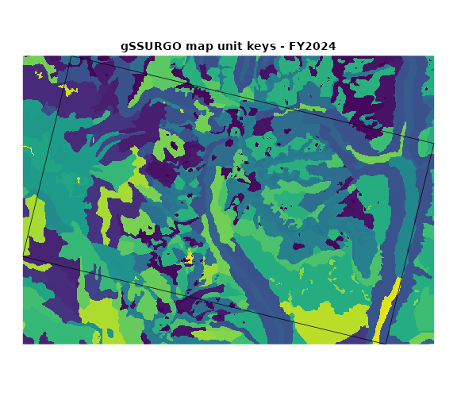
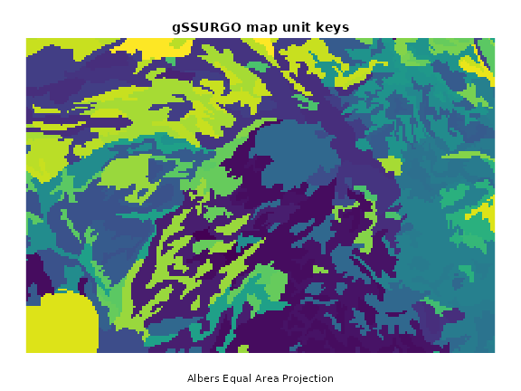
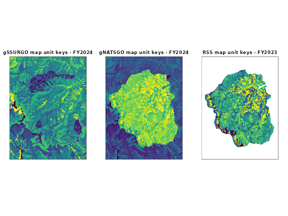
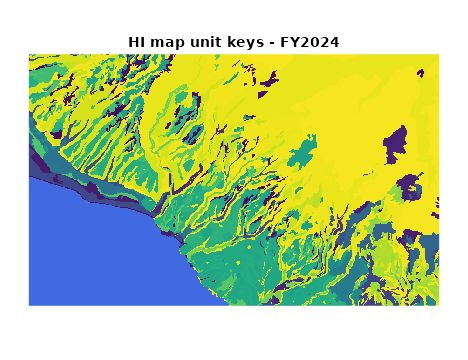
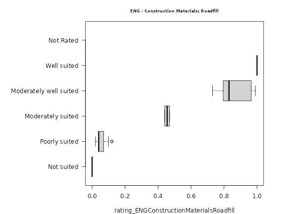
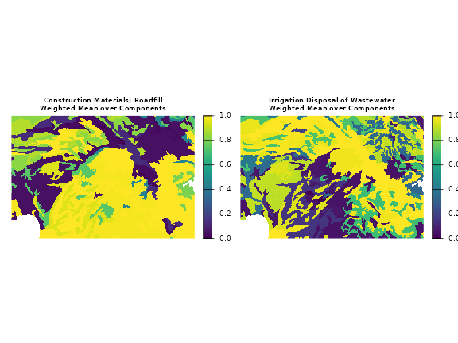
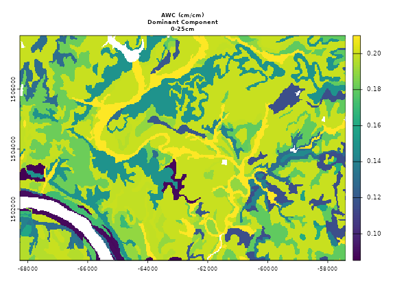
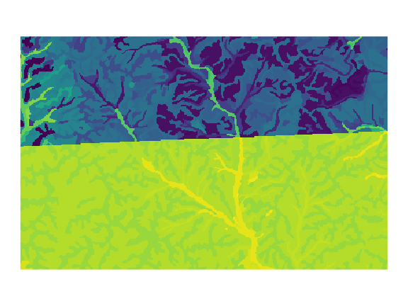
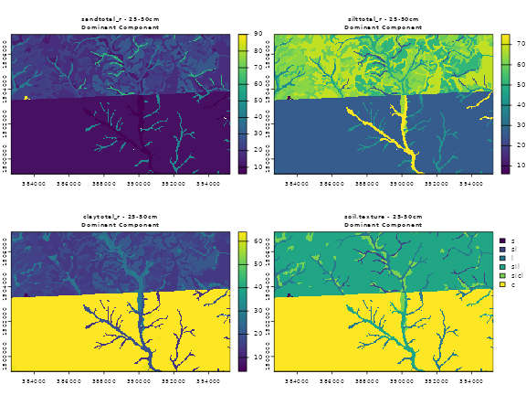

# Map Unit Key Grids and Thematic Maps of Soil Survey Geographic (SSURGO) Data

This vignette will explore how to use the soilDB package to create
thematic maps of the Soil Survey Geographic Database (SSURGO) via Soil
Data Access (SDA) and SoilWeb coverage services.

## Introduction

A web coverage service (WCS) is provided for the gSSURGO and gNATGSO
[map unit key
grids](https://nrcs.app.box.com/v/soils/folder/180456387335) by the
[UCDavis California Soil Resource
Lab](https://casoilresource.lawr.ucdavis.edu/) SoilWeb server. These
grids are a raster representation of the gSSURGO and gNATSGO map unit
keys (`mukey`) for the conterminous United States at a resolution of
30m. The GeoTIFF format is used to ensure maximum compatibility. Cell
values are map unit keys, encoded as unsigned 32-bit integers. The
standard spatial reference for the grids is Albers Equal Area Conic
(NAD83) coordinate reference system (`"EPSG:5070"`). The grids are ‘LZW’
compressed and internally tiled for efficient random access. The grid
topology and cell values are identical to the rasters contained within
the gSSURGO and gNATSGO File Geodatabases (FGDB).

The files backing each WCS are re-created annually after the SSURGO
annual refresh on October 1st. They are typically in-sync with the
official version of the data hosted by Soil Data Access by early
November. Map unit keys can change over time, especially in soil survey
areas that were updated during the last fiscal year.

In addition to the standard CONUS gSSURGO and gNATSGO grids, these web
coverage services are also provided:

- Raster Soil Survey (RSS) products at 10m resolution (EPSG:5070).

- STATSGO2 (2016) at 300m resolution (EPSG:5070).

- SSURGO in HI (EPSG:6628) and PR (EPSG:32161) at 30m resolution.

- [ISSR-800 soil property
  grids](https://casoilresource.lawr.ucdavis.edu/soil-properties/).

## Setup

Get the latest CRAN version of `soilDB`, `terra` and `sf` for the
following examples. `terra` is required for handling of raster data.
`sf` or `terra` may be used for handling vector data for as inputs to
web coverage service functions, and examples demonstrate usage of both
packages for this purpose. In general for `soilDB` functions that take
spatial inputs, if `terra` objects are used as input, `terra` objects
are returned.

``` r
install.packages(c('soilDB', 'terra', 'sf'))
```

Consider also installing the latest development versions from GitHub or
[r-universe](https://r-universe.dev/):

``` r
install.packages(c('soilDB', 'terra', 'sf'),
  repos = c('https://ncss-tech.r-universe.dev',
            'https://rspatial.r-universe.dev',
            'https://r-spatial.r-universe.dev')
)
```

### Grid Selection

Here are some basic usage examples for the coverage services that can be
accessed with
[`mukey.wcs()`](http://ncss-tech.github.io/soilDB/reference/mukey.wcs.md).

See the
[`mukey.wcs`](http://ncss-tech.github.io/soilDB/reference/mukey.wcs.md)
manual pages for details.

``` r
# select gSSURGO grid, 30m resolution
x <- mukey.wcs(aoi = aoi, db = 'gssurgo', ...)

# select gNATSGO grid, 30m resolution
x <- mukey.wcs(aoi = aoi, db = 'gnatsgo', ...)

# select RSS grid, 10m resolution
x <- mukey.wcs(aoi = aoi, db = 'RSS', ...)

# select STATSGO2 grid, 300m resolution
x <- mukey.wcs(aoi = aoi, db = 'statsgo', ...)
```

[`ISSR800.wcs`](http://ncss-tech.github.io/soilDB/reference/ISSR800.wcs.md)
is a similar function that makes available a variety of pre-aggregated
800m resolution properties derived from gNATSGO.

``` r
# select various ISSR-800 grids, details below
x <- ISSR800.wcs(aoi = aoi, var = 'paws')
```

This is where we will link to a more detailed ISSR800 vignette in the
future.

#### gSSURGO

Excerpt from the [gSSURGO
documentation](https://www.nrcs.usda.gov/resources/data-and-reports/gridded-soil-survey-geographic-gssurgo-database#release).

The gSSURGO Database is derived from the official Soil Survey Geographic
(SSURGO) Database. SSURGO generally has the most detailed level of soil
geographic data developed by the National Cooperative Soil Survey (NCSS)
in accordance with NCSS mapping standards. The tabular data represent
the soil attributes and are derived from properties and characteristics
stored in the National Soil Information System (NASIS). The gSSURGO data
were prepared by merging the traditional vector-based SSURGO digital map
data and tabular data into statewide extents, adding a statewide gridded
map layer derived from the vector layer, and adding a new value-added
look up table (Valu1) containing “ready to map” attributes. The gridded
map layer is a file geodatabase raster in an ArcGIS file geodatabase.
The raster and vector map data have a statewide extent. The raster map
data have a 10-meter cell size that approximates the vector polygons in
an Albers Equal Area projection. Each cell (and polygon) is linked to a
map unit identifier called the map unit key. A unique map unit key is
used to link the raster cells and polygons to attribute tables. Due to
file size, the raster layer for the conterminous United States is only
available in a 30-meter resolution.

#### gNATSGO

Excerpt from the [gNATSGO
documentation](https://www.nrcs.usda.gov/resources/data-and-reports/gridded-national-soil-survey-geographic-database-gnatsgo).

The gNATSGO databases contain a raster of the soil map units and 70
related tables of soil properties and interpretations. They are designed
to work with the SPSD gSSURGO ArcTools. Users can create full coverage
thematic maps and grids of soil properties and interpretations for large
geographic areas, such as the extent of a State or the conterminous
United States. Please note that the State-wide geodatabases contain a 10
meter raster and the CONUS database contains a 30 meter raster.

The gNATSGO database is composed primarily of SSURGO data, but STATSGO2
data was used to fill in the gaps. The RSSs are newer product with
relatively limited spatial extent. These RSSs were merged into the
gNATSGO after combining the SSURGO and STATSGO2 data. The extent of RSS
is expected to increase in the coming years.

#### Raster Soil Survey

Excerpt from the [RSS
documentation](https://www.nrcs.usda.gov/resources/data-and-reports/raster-soil-surveys-rss).

Raster Soil Survey is a reference to the products of soil survey work
completed using digital soil mapping methodologies. Digital soil mapping
is the production of georeferenced soil databases based on the
quantitative relationships between soil measurements made in the field
or laboratory and environmental data and may be represented as either
discrete classes or continuous soil properties. Both digital and
traditional soil mapping use a conceptual soil-landscape model as a
means for organizing environmental information into discrete divisions.
The primary difference between these two approaches is that digital
methods exploit quantitative relationships of the environmental
information, while traditional methods utilize a more subjective
approach and the approximate relationships of the environmental
information to spatially represent where the divisions are represented.

An experimental, 300m gridded representation of STATSGO 2 is provided by
the SoilWeb web coverage service. This is not an official USDA-NRCS
product.

#### STATSGO

Excerpt from [STATSGO2
Documentation](https://www.nrcs.usda.gov/resources/data-and-reports/description-of-statsgo2-database).

The Digital General Soil Map of the United States or STATSGO2 is a
broad-based inventory of soils and non-soil areas that occur in a
repeatable pattern on the landscape and that can be cartographically
shown at the scale mapped of 1:250,000 in the continental U.S., Hawaii,
Puerto Rico, and the Virgin Islands and 1:1,000,000 in Alaska. The level
of mapping is designed for broad planning and management uses covering
state, regional, and multi-state areas. The U.S. General Soil Map is
comprised of general soil association units and is maintained and
distributed as a spatial and tabular dataset.

### Thematic Mapping

Thematic mapping or analysis of soil information requires connecting the
grids to our tabular data sources, either using local files or Soil Data
Access (SDA) web-service. The `soilDB` package provides many convenient
interfaces to SDA. Note that SDA does not yet contain tabular data for
the raster soil surveys.

### Caveats / Limitations

- Requests are limited to images sizes of 5000x5000 pixels, this is
  approximately 1 degree x 1 degree (longitude, latitude) at 30m.

### Web Coverage Service Requests Using Bounding Boxes

A buffer applied to a [single WGS84
coordinate](https://casoilresource.lawr.ucdavis.edu/gmap/?loc=36.52578,-118.55639,z13)
can be used to create a bounding box (BBOX):

We can create a terra SpatVector containing the single point, then
create a 1000m radius circular polygon around the point with
[`buffer()`](https://rspatial.github.io/terra/reference/buffer.html):

``` r
library(terra)
library(soilDB)

# example point, WGS84 coordinates
p <- vect(
  data.frame(
    lon = -118.55639,
    lat = 36.52578
  ),
  crs = "EPSG:4326"
)

# 1000m buffer applied to WGS84 coordinate
# radius defined in meters
b <- buffer(p, 1000)

# query WCS
# result is in EPSG:5070
mu <- mukey.wcs(b, db = 'gSSURGO')

# inspect
plot(
  mu,
  legend = FALSE,
  axes = FALSE,
  main = paste0(metags(mu)$value, collapse = " - ")
)

# add buffer, after transforming to mukey grid CRS
plot(project(b, "EPSG:5070"), add = TRUE)

# add original point, after transforming to mukey grid CRS
plot(project(p, "EPSG:5070"), add = TRUE, pch = 16)
```


#### Manual Creation of Bounding Boxes

Sometimes it is convenient to specify a BBOX created from a website or
single point specified in WGS84 coordinates. Arbitrary spatial objects
can be used as input.
[SoilWeb](https://casoilresource.lawr.ucdavis.edu/gmap/) provides two
keyboard shortcuts in the map interface:

- Press `'b'` to copy the current bounding box coordinates, returned as:
  `-118.6609 36.4820,-118.6609 36.5972,-118.3979 36.5972,-118.3979 36.4820,-118.6609 36.4820`.
  These five coordinates pairs form a rectangular polygon, the geometry
  of which can be represented as [Well-Known
  Text](https://en.wikipedia.org/wiki/Well-known_text_representation_of_geometry).

- Press `'p'` copy link to center coordinate, returned as:
  `https://casoilresource.lawr.ucdavis.edu/gmap/?loc=36.53964,-118.52943,z13`

Right-clicking anywhere in the map interface will also generate a link
to those coordinates and zoom level.

``` r
library(sf)
library(soilDB)
library(terra)

# paste the five coordinates comprising the BBOX polygon here
bb <- '-118.6609 36.4820,-118.6609 36.5972,-118.3979 36.5972,-118.3979 36.4820,-118.6609 36.4820'

# convert WKT string -> sfc geometry
wkt <- sprintf('POLYGON((%s))', bb)
x <- st_as_sfc(wkt)

# set coordinate reference system as GCS/WGS84
st_crs(x) <- 4326

# query WCS
mu <- mukey.wcs(x, db = 'gSSURGO')

# inspect
plot(
  mu, 
  legend = FALSE, 
  axes = FALSE, 
  main = paste0(metags(mu)$value, collapse = " - ")
)

# add original BBOX, after transforming to mukey grid CRS
plot(st_transform(x, 5070), add = TRUE)
```



## Map Unit Key Grids

Use the
[`mukey.wcs()`](http://ncss-tech.github.io/soilDB/reference/mukey.wcs.md)
function to access chunks of the CONUS “map unit key” grids. The area of
interest (AOI) can be defined manually, as below, or automatically
extracted from `sf`, `sfc`, `bbox`, `SpatRaster`, `SpatVector`,
`Spatial*` or `RasterLayer` objects.

The resulting grid of integers (`mukey`; or map unit key) represents
unique map units within specific soil survey areas; the grid isn’t all
that useful by itself.

To make the grids more useful, join data from Soil Data Access (SDA) or
local files to create thematic maps based on the map unit key. SSURGO
data for specific soil components, depths, and properties within a map
unit can be aggregated so the aggregate values are 1:1 with `mukey`,
then the resulting values can be used to symbolize the map.

``` r
# make a bounding box and assign a CRS (4326: GCS, WGS84)
a <- st_bbox(
  c(xmin = -114.16, xmax = -114.08, ymin = 47.65, ymax = 47.68), 
  crs = st_crs(4326)
)

# fetch gSSURGO map unit keys at native resolution (30m)
mu <- mukey.wcs(aoi = a, db = 'gssurgo')

# check:
print(mu)
#> class       : SpatRaster 
#> size        : 147, 219, 1  (nrow, ncol, nlyr)
#> resolution  : 30, 30  (x, y)
#> extent      : -1365495, -1358925, 2869245, 2873655  (xmin, xmax, ymin, ymax)
#> coord. ref. : NAD83 / Conus Albers (EPSG:5070) 
#> source(s)   : memory
#> varname     : file2427226f1f59 
#> categories  : mukey 
#> name        :   mukey 
#> min value   :  144983 
#> max value   : 1716001

plot(
  mu, 
  main = 'gSSURGO map unit keys',
  sub = 'Albers Equal Area Projection',
  axes = FALSE, 
  legend = FALSE
)
```



### SSURGO Polygons from SDA

It is possible to retrieve vector geometries from SDA with the
[`SDA_spatialQuery()`](http://ncss-tech.github.io/soilDB/reference/SDA_spatialQuery.md)
function. Standard SSURGO map unit polygons can be obtained in addition
to soil survey area polygons and STATSGO map unit polygons.

The vector data are stored and delivered in a geographic coordinate
system (WGS84), whereas the WCS grids generally use a locally relevant
projected coordinate system (`"EPSG:5070"` in CONUS). Overlaying SSURGO
polygons and map unit key grids will therefore require a simple
transformation.

First get intersecting SSURGO polygons from SDA with
[`SDA_spatialQuery()`](http://ncss-tech.github.io/soilDB/reference/SDA_spatialQuery.md)

``` r
# because mu is a SpatRaster, result is a SpatVector object (GCS WGS84)
p <- SDA_spatialQuery(mu, what = 'mupolygon', geomIntersection = TRUE)
```

Then transform to AEA coordinate reference system used by CONUS gSSURGO
/ gNATSGO (`"EPSG:5070"`).

``` r
p <- project(p, crs(mu))
```

Inspect the result by overlaying SSURGO polygons on the 30m map unit key
grid.

``` r
plot(mu,
     main = 'gSSURGO Grid (WCS)\nSSURGO Polygons (SDA)',
     axes = FALSE,
     legend = FALSE)
plot(p, add = TRUE, border = 'white')
mtext('CONUS Albers Equal Area Projection (EPSG:5070)', side = 1, line = 1)
```


### Grid Resolution Specification

Requesting map unit key grids at a resolution other than 30m is
possible, but only suitable for a quick “preview” of the data.

For example, it is possible to get a larger areal extent of data by
requesting grids at coarser resolution (e.g. 800m).

However, the pixels represent categories (unique map units) and are
selected by nearest-neighbor; there is no other generalization used to
convert the source 30m grid to the coarser scale. A coarser
representation of data can be used for inspection of general patterns.
Detailed analysis should be based on derived property data sets
aggregated up from 30m results.

``` r
# make a bounding box (in California) and assign a CRS (GCS WGS84 / EPSG:4326)
a.CA <- st_bbox(c(
  xmin = -121,
  xmax = -120,
  ymin = 37,
  ymax = 38
), crs = st_crs(4326))

# fetch gSSURGO map unit keys at ~800m
# nearest-neighbor resampling = this is a "preview"
# result is a SpatRaster object
x.800 <- mukey.wcs(aoi = a.CA, db = 'gssurgo', res = 800)

plot(
  x.800,
  main = 'A Preview of gSSURGO Map Unit Keys',
  sub = 'Albers Equal Area Projection (800m)\nnearest-neighbor resampling',
  axes = FALSE,
  legend = FALSE
)
```


### Raster Soil Survey Data

The specific RSS (state-level) data sets can be downloaded (map unit key
grids, tabular data) on Box: `https://nrcs.app.box.com/v/soils`. Please
note that tabular data for Raster Soil Surveys are not yet available via
Soil Data Access.

``` r
# Coweeta Hydrologic Laboratory extent; specified in EPSG:5070
a <- st_bbox(
  c(xmin = 1129000, xmax = 1135000, ymin = 1403000, ymax = 1411000), 
  crs = st_crs(5070)
)

# convert boundary sf polygon
a <- st_as_sfc(a)

# gSSURGO grid: 30m resolution
(x <- mukey.wcs(a, db = 'gSSURGO', res = 30))
#> class       : SpatRaster 
#> size        : 267, 200, 1  (nrow, ncol, nlyr)
#> resolution  : 30, 30  (x, y)
#> extent      : 1129005, 1135005, 1402995, 1411005  (xmin, xmax, ymin, ymax)
#> coord. ref. : NAD83 / Conus Albers (EPSG:5070) 
#> source(s)   : memory
#> varname     : file24274dc82f43 
#> categories  : mukey 
#> name        :  mukey 
#> min value   : 545800 
#> max value   : 545887

# gNATSGO grid: 30m resolution
(y <- mukey.wcs(a, db = 'gNATSGO', res = 30))
#> class       : SpatRaster 
#> size        : 267, 200, 1  (nrow, ncol, nlyr)
#> resolution  : 30, 30  (x, y)
#> extent      : 1129005, 1135005, 1402995, 1411005  (xmin, xmax, ymin, ymax)
#> coord. ref. : NAD83 / Conus Albers (EPSG:5070) 
#> source(s)   : memory
#> varname     : file24272421e316 
#> categories  : mukey 
#> name        :   mukey 
#> min value   :  545800 
#> max value   : 3244759

# RSS grid: 10m resolution
(z <- mukey.wcs(a, db = 'RSS', res = 10))
#> class       : SpatRaster 
#> size        : 800, 600, 1  (nrow, ncol, nlyr)
#> resolution  : 10, 10.0125  (x, y)
#> extent      : 1129005, 1135005, 1402995, 1411005  (xmin, xmax, ymin, ymax)
#> coord. ref. : NAD83 / Conus Albers (EPSG:5070) 
#> source(s)   : memory
#> varname     : file242763cd1a1 
#> categories  : mukey 
#> name        :   mukey 
#> min value   : 3244721 
#> max value   : 3244759

# graphical comparison
par(mfcol = c(1, 3))


# gSSURGO
plot(
  x,
  axes = FALSE,
  legend = FALSE,
  main = paste0(metags(x)$value, collapse = " - ")
)
plot(a, add = TRUE)

# gNATSGO
plot(
  y,
  axes = FALSE,
  legend = FALSE,
  main = paste0(metags(y)$value, collapse = " - ")
)
plot(a, add = TRUE)

# RSS
plot(
  z,
  axes = FALSE,
  legend = FALSE,
  main = paste0(metags(z)$value, collapse = " - "),
  ext = x
)
plot(a, add = TRUE)
```



### STATSGO

Continuing from the example above, we can use `db='statsgo'` to compare
gSSURGO product with the Digital General Soil Map of the United States
(STATSGO2). STATSGO data are provided at 10x the nominal resolution of
gSSURGO (300m v.s. 30m) to reflect the relative generality of this
product.

``` r
(statsgo <- mukey.wcs(a, db = 'statsgo', res = 300))
#> class       : SpatRaster 
#> size        : 27, 20, 1  (nrow, ncol, nlyr)
#> resolution  : 300, 300  (x, y)
#> extent      : 1129005, 1135005, 1402995, 1411095  (xmin, xmax, ymin, ymax)
#> coord. ref. : NAD83 / Conus Albers (EPSG:5070) 
#> source(s)   : memory
#> varname     : file24277e20ecae 
#> categories  : mukey 
#> name        :  mukey 
#> min value   : 659074 
#> max value   : 664845

# graphical comparison
par(mfcol = c(1, 2))

# gSSURGO
plot(
  x,
  axes = FALSE,
  legend = FALSE,
  main = paste0(metags(mu)$value, collapse = " - ")
)

# STATSGO
plot(
  statsgo,
  axes = FALSE,
  legend = FALSE,
  main = paste0(metags(statsgo)$value, collapse = " - ")
)
```


### Hawaii SSURGO

A new 30m SSURGO map unit key WCS based on the `"EPSG:6628"` coordinate
reference system has been added for Hawaii.

The example bounding box is centered on the [southern coast of
Kauai](https://casoilresource.lawr.ucdavis.edu/gmap/?loc=21.97839,-159.61727,z13).

``` r
# paste your BBOX text here
bb <- '-159.7426 21.9059,-159.7426 22.0457,-159.4913 22.0457,-159.4913 21.9059,-159.7426 21.9059'

# convert WKT string -> sfc geometry
wkt <- sprintf('POLYGON((%s))', bb)
x <- st_as_sfc(wkt, crs = 4326)

# query WCS
mu <- mukey.wcs(x, db = 'hi_ssurgo')

# make NA (the ocean) blue
plot(
  mu,
  legend = FALSE,
  axes = FALSE,
  main = paste0(metags(mu)$value, collapse = " - "),
  colNA = 'royalblue'
)
```



### Puerto Rico SSURGO

A new 30m SSURGO map unit key WCS based on the `"EPSG:32161"` coordinate
reference system has been added for Puerto Rico.

The example bounding box is centered on the [eastern coast of Puerto
Rico](https://casoilresource.lawr.ucdavis.edu/gmap/?loc=18.24843,-65.67369,z13).

``` r
# paste your BBOX text here
bb <- '-65.7741 18.1711,-65.7741 18.3143,-65.5228 18.3143,-65.5228 18.1711,-65.7741 18.1711'

# convert WKT string -> sfc geometry
wkt <- sprintf('POLYGON((%s))', bb)
x <- st_as_sfc(wkt, crs = 4326)

# query WCS
mu <- mukey.wcs(x, db = 'pr_ssurgo')

# make missing data (NA; the ocean) blue
plot(
  mu,
  legend = FALSE,
  axes = FALSE,
  main = paste0(metags(mu)$value, collapse = " - "),
  colNA = 'royalblue'
)
```


## Thematic Mapping

The following example BBOX + resulting gSSURGO map unit key grid will be
used for thematic mapping examples:

``` r
# make a bounding box and assign a CRS (4326: GCS, WGS84)
a <- st_bbox(
  c(xmin = -114.16, xmax = -114.08, ymin = 47.65, ymax = 47.68), 
  crs = st_crs(4326)
)

# convert bbox to sf geometry
a <- st_as_sfc(a)

# fetch gSSURGO map unit keys at native resolution (~30m)
mu <- mukey.wcs(aoi = a, db = 'gssurgo')
```

### Map Unit Aggregate Values

The “Mapunit Aggregate Attribute” table records a variety of soil
attributes and interpretations that have been aggregated from the
component level to a single value at the map unit level. They have been
aggregated by one or more appropriate means in order to express a
consolidated value or interpretation for the map unit as a whole.

Use the
[`get_SDA_muaggatt()`](http://ncss-tech.github.io/soilDB/reference/get_SDA_muaggatt.md)
function, or write a query in SQL and submit via
[`SDA_query()`](http://ncss-tech.github.io/soilDB/reference/SDA_query.md).

``` r
# copy example grid
mu2 <- mu

# extract raster attribute table for thematic mapping
(rat <- cats(mu2)[[1]])
#>         ID   mukey
#> 1   144983  144983
#> 2   144984  144984
#> 3   144985  144985
#> 4   144986  144986
#> 5   145005  145005
#> 6   145009  145009
#> 7   145010  145010
#> 8   145011  145011
#> 9   145012  145012
#> 10  145015  145015
#> 11  145017  145017
#> 12  145019  145019
#> 13  145020  145020
#> 14  145056  145056
#> 15  145057  145057
#> 16  145058  145058
#> 17  145059  145059
#> 18  145060  145060
#> 19  145068  145068
#> 20  145069  145069
#> 21  145070  145070
#> 22  145076  145076
#> 23  145079  145079
#> 24  145118  145118
#> 25  145183  145183
#> 26  145195  145195
#> 27  145208  145208
#> 28  145250  145250
#> 29  145253  145253
#> 30  145264  145264
#> 31  145269  145269
#> 32  145275  145275
#> 33  145278  145278
#> 34  145328  145328
#> 35  145329  145329
#> 36  145340  145340
#> 37  145343  145343
#> 38  145385  145385
#> 39 1715935 1715935
#> 40 1716001 1716001

# optionally use convenience function:
# * returns all fields from muaggatt table
# * along with map unit name
# tab <- get_SDA_muaggatt(mukeys = as.numeric(rat$mukey), query_string = TRUE)

.sql <- paste0(
  "SELECT mukey, aws050wta, aws0100wta FROM muaggatt WHERE mukey IN ",
  format_SQL_in_statement(as.numeric(rat$mukey))
)

# run query, result is a data.frame
tab <- SDA_query(.sql)

# check
head(tab)
#>    mukey aws050wta aws0100wta
#> 1 144983      7.26      14.02
#> 2 144984      7.31      14.14
#> 3 144985      7.36      14.27
#> 4 144986      7.06      13.19
#> 5 145005      5.21       9.34
#> 6 145009      5.49       9.16

# set raster categories
levels(mu2) <- tab

# convert grid + RAT -> stack of property grids
aws <- catalyze(mu2)

# plot, set a common range [0, 20] for both layers
plot(
  aws,
  axes = FALSE,
  cex.main = 0.7,
  main = c(
    'Plant Available Water Storage (cm)\nWeighted Mean over Components, 0-50cm',
    'Plant Available Water Storage (cm)\nWeighted Mean over Components, 0-100cm'
  ),
  range = c(0, 20)
)
```


### Interpretations for Soil Suitability / Limitation

You can use the
[`get_SDA_interpretation()`](http://ncss-tech.github.io/soilDB/reference/get_SDA_interpretation.md)
function to return interpretation ratings for specific components, or
aggregated up to the map unit level. Here, we produce maps using two
interpretation rules: `'ENG - Construction Materials; Roadfill'`, and
`'AWM - Irrigation Disposal of Wastewater'`.

``` r
# copy example grid
mu2 <- mu

# extract RAT for thematic mapping
rat <- cats(mu2)[[1]]

rules <- c('ENG - Construction Materials; Roadfill',
           'AWM - Irrigation Disposal of Wastewater')

tab <- get_SDA_interpretation(
  rulename = rules, 
  method = "Weighted Average", 
  mukeys = as.numeric(rat$mukey)
)

# check
head(tab)
#>   areasymbol musym                                                            muname   mukey
#> 1      MT629 1044D Eaglewing gravelly silt loam, 8 to 15 percent slopes, lake effect 1715935
#> 2      MT629     W                                                             Water  145385
#> 3      MT629   130                           Polson silt loam, 0 to 2 percent slopes  145017
#> 4      MT629   129                                                      Pits, gravel  145015
#> 5      MT629   126                         Ninepipe silt loam, 0 to 2 percent slopes  145012
#> 6      MT629   125                      Niarada-Kerl complex, 8 to 15 percent slopes  145011
#>   rating_ENGConstructionMaterialsRoadfill rating_AWMIrrigationDisposalofWastewater
#> 1                                    0.83                                     0.99
#> 2                                      NA                                       NA
#> 3                                    0.04                                     0.90
#> 4                                    1.00                                     1.00
#> 5                                    0.00                                     0.15
#> 6                                    0.88                                     0.96
#>   class_ENGConstructionMaterialsRoadfill class_AWMIrrigationDisposalofWastewater
#> 1                 Moderately well suited                      Moderately limited
#> 2                              Not Rated                               Not Rated
#> 3                          Poorly suited                      Moderately limited
#> 4                            Well suited                            Very limited
#> 5                             Not suited                        Slightly limited
#> 6                 Moderately well suited                      Moderately limited
#>                                                                                                  reason_ENGConstructionMaterialsRoadfill
#> 1          Dusty (0.834); Dusty (0.834); Dusty (0.996); Wetness (0.98); Dusty (0.98); Wetness (0.142); Low strength (0.222); Dusty (0.8)
#> 2               Not rated; Slope (); Not rated; Fragments 75 to 250mm (); Not rated; Fragments > 250m (); Not rated (); Low strength (0)
#> 3 Low strength (0); Dusty (0.774); Low strength (0); Dusty (0.778); Low strength (0.778); Dusty (0.785); Low strength (0); Dusty (0.783)
#> 4               Not rated; Slope (); Not rated; Fragments 75 to 250mm (); Not rated; Fragments > 250m (); Not rated (); Low strength (0)
#> 5                     Low strength (0); Dusty (0.774); Low strength (0); Wetness (0.036); Dusty (0.785); Low strength (0); Dusty (0.785)
#> 6                          Dusty (0.981); Low strength (0); Dusty (0.783); Low strength (0); Dusty (0.785); Dusty (0.981); Dusty (0.902)
#>                                                                                                                                                                                                                                                                                                                                                                                                                      reason_AWMIrrigationDisposalofWastewater
#> 1                                     Too steep for surface application (1); Too steep for sprinkler application (0.778); Slow water movement (0.372); Too steep for surface application (1); Large stones on the surface (0.884); Too steep for sprinkler application (0.778); Slow water movement (0.372); Too steep for surface application (1); Too steep for sprinkler application (0.395); Depth to saturated zone (0.677); Depth to saturated zone (1)
#> 2                                                                                                                                                                                                                                                                                                                                            Not rated; Ksat (); Not rated; Ksat (); Not rated; Fragments 75 to 250mm (); Not rated; pH (); Not rated; AWC ()
#> 3                                                                                                                                                                                                                                                                                                                                                                Sodium content (1); Slow water movement (1); Sodium content (1); Slow water movement (0.372)
#> 4                                                                                                                                                                                                                                                                                                  Not rated; Ksat (); Not rated; Ksat (); Not rated; Fragments 75 to 250mm (); Not rated; pH (); Not rated; AWC (); Filtering capacity (1); Droughty (0.782)
#> 5                                                                                                                                                                                                                                                                                                                                                                    Sodium content (1); Slow water movement (1); Depth to saturated zone (1); Flooding (0.6)
#> 6 Too steep for surface application (1); Too steep for sprinkler application (0.778); Large stones on the surface (0.141); Droughty (0.117); Sodium content (1); Too steep for surface application (0.68); Slow water movement (0.372); Too steep for surface application (1); Too steep for sprinkler application (0.778); Droughty (0.133); Too steep for sprinkler application (0.778); Slow water movement (0.372); Too steep for surface application (1)

# set ordered factor levels (for nice label/legend order)
tab$class_ENGConstructionMaterialsRoadfill <- factor(
  tab$class_ENGConstructionMaterialsRoadfill,
  levels = c(
    'Not suited',
    'Poorly suited',
    'Moderately suited',
    'Moderately well suited',
    'Well suited',
    'Not Rated'
  ),
  ordered = TRUE
)

par(mar = c(4, 12, 3, 3))
boxplot(
  rating_ENGConstructionMaterialsRoadfill ~ class_ENGConstructionMaterialsRoadfill,
  cex.main = 0.7,
  main = 'ENG - Construction Materials; Roadfill',
  ylab = "",
  data = tab,
  horizontal = TRUE, # fuzzy ratings on X axis
  las = 1            # rotate axis labels 90 degrees
)
```



From above graph we can see that the different suitability rating
classes `class_ENGConstructionMaterialsRoadfill` each correspond to a
range of fuzzy values (`rating_ENGConstructionMaterialsRoadfill`).

Next, we can view the ratings as a thematic map:

``` r
vars <- c(
  'rating_ENGConstructionMaterialsRoadfill',
  'rating_AWMIrrigationDisposalofWastewater'
)

# set raster categories
levels(mu2) <- tab[, c('mukey', vars)]

rating <- catalyze(mu2)

# inspect
plot(
  rating,
  axes = FALSE,
  cex.main = 0.7,
  main = c(
    'Construction Materials; Roadfill\nWeighted Mean over Components',
    'Irrigation Disposal of Wastewater\nWeighted Mean over Components'
  )
)
```



### Component-level Properties

Soil “components” are the members (land types) of a map unit. A map unit
may contain several distinct soil and non-soil areas.

A widely-used property which is calculated as a standard part of SSURGO
soil map unit components is the “steel corrosion potential”. Here we
also use
[`get_SDV_legend_elements()`](http://ncss-tech.github.io/soilDB/reference/get_SDV_legend_elements.md)
to get the standard Soil Data Viewer colors for the selected
property/interpretation.

``` r
# copy example grid
mu2 <- mu

# extract RAT for thematic mapping
rat <- cats(mu2)[[1]]

tab <- get_SDA_property(property = 'Corrosion of Steel', 
                        method = 'DOMINANT CONDITION',
                        mukeys = as.integer(rat$mukey),
                        miscellaneous_areas = TRUE)

# get soil data viewer standard colors for corsteel
cols <- get_SDV_legend_elements("attributecolumnname = 'corsteel'")

# set raster categories
levels(mu2) <- tab[, c('mukey', 'corsteel')]

# set active category
activeCat(mu2) <- 'corsteel'

# plot
plot(
  mu2,
  col = cols$hex[na.omit(match(unique(tab$corsteel), cols$label))],
  axes = FALSE,
  legend = "topleft"
)
```


Another example is thematic mapping of the “simplified component parent
material group”. First, set up a new AOI for the following examples:

``` r
# https://casoilresource.lawr.ucdavis.edu/gmap/?loc=36.57666,-96.70175,z14
# make a bounding box and assign a CRS (4326: GCS, WGS84)
a <- st_bbox(
  c(xmin = -96.7696, xmax = -96.6477, 
    ymin = 36.5477, ymax = 36.6139), 
  crs = st_crs(4326)
)

# fetch gSSURGO map unit keys at native resolution (~30m)
mu <- mukey.wcs(aoi = a, db = 'gssurgo')

plot(
  mu, 
  legend = FALSE, 
  axes = FALSE, 
  cex.main = 0.7,
  main = 'gSSURGO Map Unit Key Grid'
)
```


We use
[`get_SDA_pmgroupname()`](http://ncss-tech.github.io/soilDB/reference/get_SDA_pmgroupname.md)
to obtain the tabular parent material information to relate to map unit
keys:

``` r
# copy example grid
mu2 <- mu

# extract RAT for thematic mapping
rat <- cats(mu2)[[1]]

# simplified parent material group name
tab <- get_SDA_pmgroupname(mukeys = as.integer(rat$mukey),
                           miscellaneous_areas = TRUE)

# set raster categories
levels(mu2) <- tab[, c('mukey', 'pmgroupname')]

# set active category
activeCat(mu2) <- 'pmgroupname'

plot(mu2, legend = "topleft", axes = FALSE)
```


We can also inspect a mapunit-level hydric rating derived from the
default aggregation method in
[`get_SDA_hydric()`](http://ncss-tech.github.io/soilDB/reference/get_SDA_hydric.md).

``` r
# copy example grid
mu2 <- mu

# extract RAT for thematic mapping
rat <- cats(mu2)[[1]]

# simplified parent material group name
tab <- get_SDA_hydric(mukeys = as.integer(rat$mukey))

levels(mu2) <- tab[, c('mukey', 'HYDRIC_RATING')]

# set active category 
activeCat(mu2) <- 'HYDRIC_RATING'
plot(mu2, legend = "topleft", axes = FALSE)
```


### Several Horizon-level Soil Properties

The
[`get_SDA_property()`](http://ncss-tech.github.io/soilDB/reference/get_SDA_property.md)
function from `soilDB` is a general interface to aggregated
SSURGO/STATSGO tabular data via SDA. It was used to obtain a
component-level property previously (steel corrosion), and now we will
use it to aggregate several horizon-level property values for a specific
depth interval.

Derive aggregate soil properties, merge with raster attribute table
(RAT).

``` r
# extract RAT for thematic mapping
rat <- cats(mu)[[1]]

# variables of interest
vars <- c("dbthirdbar_r", "awc_r", "ph1to1h2o_r")

# get / aggregate specific horizon-level properties from SDA
# be sure to see the manual page for this function
tab <- get_SDA_property(property = vars,
                        method = "Dominant Component (Numeric)", 
                        mukeys = as.integer(rat$mukey),
                        top_depth = 0,
                        bottom_depth = 25)


# check
head(tab)
#>    mukey areasymbol musym                                                                   muname
#> 1 623396      OK113     1                          Apperson silty clay loam, 1 to 3 percent slopes
#> 2 623399      OK113     4                                        Coyle loam, 1 to 3 percent slopes
#> 3 623402      OK113     7 Keokuk very fine sandy loam, 0 to 1 percent slopes, occasionally flooded
#> 4 623405      OK113    10                                 Bethany silt loam, 1 to 3 percent slopes
#> 5 623406      OK113    11                                 Bethany silt loam, 3 to 5 percent slopes
#> 6 623407      OK113    12                          Bethany-Pawhuska complex, 1 to 5 percent slopes
#>   dbthirdbar_r  awc_r ph1to1h2o_r
#> 1       1.4500 0.1800       6.148
#> 2       1.4000 0.1800       5.700
#> 3       1.4316 0.1716       7.300
#> 4       1.3500 0.2000       6.200
#> 5       1.3000 0.2000       6.300
#> 6       1.3400 0.2000       6.300

# convert areasymbol into a factor easy plotting later
tab$areasymbol <- factor(tab$areasymbol)

# set raster categories
levels(mu) <- tab[, c('mukey', vars)]

# list variables in the RAT
names(cats(mu)[[1]])
#> [1] "mukey"        "dbthirdbar_r" "awc_r"        "ph1to1h2o_r"

# convert categories associated with keys to values
mu2 <- catalyze(mu)
```

Inspect just the plant available water 0-25cm.

``` r
plot(mu2$awc_r)
```


Plot aggregate soil properties.

``` r
plot(mu2[['dbthirdbar_r']], cex.main = 0.7,
     main = '1/3 Bar Bulk Density (g/cm^3)\nDominant Component\n0-25cm')
```


``` r

plot(mu2[['awc_r']], cex.main = 0.7,
     main = 'AWC (cm/cm)\nDominant Component\n0-25cm')
```



``` r

plot(mu2[['ph1to1h2o_r']], cex.main = 0.7,
     main = 'pH 1:1 H2O\nDominant Component\n0-25cm')
```


### Sand, Silt, and Clay at a Soil Survey Area Boundary

Here is an example of not so great exact join between soil survey areas.
In this case the one soil survey was published in 1979 and the other in
2004.

First, we setup BBOX and query map unit key WCS.

``` r
# extract a BBOX like this from SoilWeb by pressing "b"
bb <- '-91.6853 36.4617,-91.6853 36.5281,-91.5475 36.5281,-91.5475 36.4617,-91.6853 36.4617'
wkt <- sprintf('POLYGON((%s))', bb)

# init sf object from WKT
x <- st_as_sfc(wkt, crs = 4326)

# get gSSURGO grid here
mu <- mukey.wcs(aoi = x, db = 'gssurgo')

# note SSA boundary
plot(mu, legend = FALSE, axes = FALSE)
```



Then we derive aggregate sand, silt, clay (RV) values from the largest
component, taking the weighted mean over 25-50cm depth interval. We also
will take the sand and clay values to calculate the surface texture
class for comparison.

``` r
# extract RAT for thematic mapping
rat <- cats(mu)[[1]]

# variables of interest
vars <- c("sandtotal_r", "silttotal_r", "claytotal_r")

# get thematic data from SDA
# dominant component
# depth-weighted average
# sand, silt, clay (RV)
tab <-  get_SDA_property(property = vars,
                         method = "Dominant Component (Numeric)", 
                         mukeys = as.integer(rat$mukey),
                         top_depth = 25,
                         bottom_depth = 50) 

# check
head(tab)
#>     mukey areasymbol musym                                                              muname
#> 1  691980      MO091 73306               Gressy-Gatewood complex, 3 to 8 percent slopes, rocky
#> 2 2502332      MO149 73321                       Alred-Gatewood complex, 1 to 8 percent slopes
#> 3 2502334      MO149 73322                      Alred-Gatewood complex, 8 to 15 percent slopes
#> 4 2503322      MO149 76002 Batcave-Farewell complex, 1 to 3 percent slopes, frequently flooded
#> 5 2503473      MO149 76046             Secesh silt loam, 1 to 3 percent slopes, rarely flooded
#> 6 2503476      MO149 76047    Secesh-Tilk complex, 1 to 3 percent slopes, occasionally flooded
#>   sandtotal_r silttotal_r claytotal_r
#> 1      23.000      59.000      18.000
#> 2      28.692      51.108      20.200
#> 3      28.692      51.108      20.200
#> 4      40.000      40.000      20.000
#> 5      25.648      49.000      25.352
#> 6      26.908      48.076      25.016

# set raster categories
levels(mu) <- tab[, c('mukey', vars)]

# convert mukey grid + RAT -> stack of numerical grids
# retaining only sand, silt, clay via [[vars]]
ssc <- catalyze(mu)

# create a copy of the grid
texture.class <- ssc[[1]]
names(texture.class) <- 'soil.texture'

# assign soil texture classes for the fine earth fraction
# using sand and clay percentages
values(texture.class) <- aqp::ssc_to_texcl(
  sand = values(ssc[['sandtotal_r']]), 
  clay = values(ssc[['claytotal_r']]), 
  droplevels = FALSE
)
r <- c(ssc, texture.class)

# graphical check
plot(
  r,
  cex.main = 0.7,
  main = paste0(names(r), " - 25-50cm\nDominant Component")
)
```


